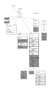

## Overview

Rindow-Math-Matrix employs OpenCL for computational acceleration. The primary reason for choosing OpenCL is its potential to support a diverse range of arithmetic acceleration devices in the future, including not only GPUs but also FPGAs and signal processors. This approach is expected to allow users to benefit from GPU acceleration even on relatively accessible laptop environments.

However, OpenCL support alone is not sufficient to accelerate numerical operations. High-performance computation libraries that utilize OpenCL are also necessary. Rindow-Math-Matrix achieves OpenCL-based acceleration by providing the following libraries and features:

*   **CLBlast**: An OpenCL-based BLAS (Basic Linear Algebra Subprograms) compatible library that is currently under active development.
*   **Rindow Math Matrix's custom OpenCL functions**: Features that enable the execution of mathematical functions not included in BLAS, as well as other necessary operations, on OpenCL.

## Key Components

To realize GPU acceleration, Rindow-Math-Matrix utilizes and provides the following key components:

### Rindow OpenCL FFI

This is a library for using OpenCL directly from PHP.
*   **Role**: Provides an interface between PHP applications and OpenCL drivers.
*   **Supported OpenCL Versions**: Supports OpenCL 1.1 or 1.2, enabling use in a wide range of environments.
*   **Current Status and Future**: Currently, it has a minimal set of features primarily intended for use with Rindow's neural network library, but it is planned to be extended in the future.
*   **Details**: [Rindow OpenCL FFI (GitHub)](https://github.com/rindow/rindow-opencl-ffi)

### Rindow CLBlast FFI

These are bindings for using CLBlast, a BLAS library that runs on OpenCL, from PHP.
*   **CLBlast**: A library that implements highly efficient BLAS operations using OpenCL. [CLBlast Details (GitHub)](https://github.com/CNugteren/CLBlast)
*   **Role**: Allows CLBlast functions to be called from PHP.
*   **Details**: [Rindow CLBlast FFI (GitHub)](https://github.com/rindow/rindow-clblast)

### Rindow Math Matrix OpenCLMath Library

This is an internal library within Rindow Math Matrix that provides various mathematical functions and operations on OpenCL that are not covered by BLAS libraries alone.

## System Requirements

The system requirements for using the GPU acceleration feature are as follows:

*   **PHP**: 8.1, 8.2, 8.3, 8.4
*   **PHP Interface**: `interop-phpobjects/polite-math` 1.0.6 or later
*   **OpenCL**: OpenCL 1.1 or later drivers and libraries
*   **Operating System**: Windows 10, 11 or Linux (Ubuntu 22.04 or Debian 12 or later)
*   **Rindow Library Suite**:
    *   Rindow Math Matrix
    *   Rindow Math Buffer FFI
    *   Rindow OpenBLAS FFI
    *   Rindow Matlib FFI
    *   Rindow OpenCL FFI
    *   Rindow CLBlast FFI
*   **External Libraries**:
    *   OpenBLAS 0.3.20 or later
    *   CLBlast 1.5.2 or later

## Setup Instructions

### Setting up on Windows Environment

In many Windows environments, OpenCL is available by default with the OS.

1.  **Download and Place Pre-built Binaries**:
    Download the pre-built binaries for the following libraries and extract them to a location of your choice.
    *   [OpenBLAS](https://github.com/OpenMathLib/OpenBLAS/releases)
    *   [Rindow Matlib](https://github.com/rindow/matlib/releases)
    *   [CLBlast](https://github.com/CNugteren/CLBlast/releases)

2.  **Set Execution Path**:
    Add the `bin` directory of the downloaded libraries to your system's PATH. For example, if you extracted them to `C:\OpenBLAS`, `C:\Matlib`, and `C:\CLBlast`:
    ```shell
    C:TEMP>PATH %PATH%;C:\CLBlast\bin;C:\OpenBLAS\bin;C:\Matlib\bin
    ```

3.  **Enable PHP FFI Extension**:
    Edit your `php.ini` file and enable the FFI extension.
    ```ini
    extension=ffi
    ```

4.  **Set up and Verify Rindow Math Matrix**:
    Use Composer to install the necessary packages and verify the configuration.
    ```shell
    C:yourproject> composer require rindow/rindow-math-matrix
    C:yourproject> composer require rindow/rindow-math-matrix-matlibffi
    C:yourproject> vendor\bin\rindow-math-matrix
    ```
    Ensure that `Service Level` is `Accelerated` and that `OpenCL Factory` and `CLBlast Factory` are displayed in the output.
    ```
    Service Level   : Accelerated
    Buffer Factory  : Rindow\Math\Buffer\FFI\BufferFactory
    BLAS Driver     : Rindow\OpenBLAS\FFI\Blas
    LAPACK Driver   : Rindow\OpenBLAS\FFI\Lapack
    Math Driver     : Rindow\Matlib\FFI\Matlib
    OpenCL Factory  : Rindow\OpenCL\FFI\OpenCLFactory
    CLBlast Factory : Rindow\CLBlast\FFI\CLBlastFactory
    ```

5.  **Verify GPU Device Recognition (Troubleshooting)**:
    If the GPU device is not recognized as expected, use the `clinfo` command to check the status of OpenCL devices.
    ```shell
    C:tutorials>vendor\bin\clinfo
    Number of platforms(1)
    Platform(0)
        CL_PLATFORM_NAME=Intel(R) OpenCL
        CL_PLATFORM_PROFILE=FULL_PROFILE
    ....
    ```

### Setting up on Ubuntu Environment

1.  **Install Required Libraries (OpenBLAS, Rindow Matlib)**:
    ```shell
    # Install OpenBLAS and LAPACK
    $ sudo apt update
    $ sudo apt install libopenblas-base liblapacke

    # Install Rindow Matlib (replace X.X.X with the version number)
    $ wget https://github.com/rindow/rindow-matlib/releases/download/X.X.X/rindow-matlib_X.X.X_amd64.deb
    $ sudo apt install ./rindow-matlib_X.X.X_amd64.deb
    ```
    *Note: Rindow-Matlib needs to be configured in serial mode for use with PHP (this is usually the default behavior).*

2.  **Install OpenCL Drivers**:
    Install OpenCL drivers appropriate for your environment. First, install `clinfo` to be able to check information.
    ```shell
    $ sudo apt install clinfo
    ```
    Next, install the drivers for your hardware (e.g., for Intel GPUs).
    ```shell
    $ sudo apt install intel-opencl-icd
    ```
    Commonly available OpenCL drivers in Ubuntu include:
    *   `mesa-opencl-icd`
    *   `beignet-opencl-icd`
    *   `intel-opencl-icd`
    *   `nvidia-opencl-icd-xxx` (xxx is the version number)
    *   `pocl-opencl-icd`

    **Caution**: Standard OpenCL drivers on Linux may not function correctly depending on the environment and version. In such cases, specific troubleshooting for each driver or version may be required.

3.  **Verify OpenCL Operation**:
    Run the `clinfo` command to check if OpenCL platforms and devices are correctly recognized.
    ```shell
    $ clinfo
    Number of platforms                               1
      Platform Name                                   Intel Gen OCL Driver
      Platform Vendor                                 Intel
    ....
    ```

4.  **Install CLBlast Library**:
    ```shell
    $ sudo apt install libclblast1
    ```

5.  **Set up and Verify Rindow Math Matrix**:
    Use Composer to install the necessary packages and verify the configuration.
    ```shell
    $ composer require rindow/rindow-math-matrix
    $ composer require rindow/rindow-math-matrix-matlibffi # For CPU backend FFI support
    $ vendor/bin/rindow-math-matrix
    ```
    Ensure that `Service Level` is `Accelerated` and that `OpenCL Factory` and `CLBlast Factory` are displayed in the output (similar to the Windows case). You may need to install `rindow/rindow-opencl-ffi` and `rindow/rindow-clblast-ffi` separately if they are not automatically pulled in as dependencies for full GPU support.

## Using Accelerated Computing

### Creating GPU-enabled LinearAlgebra

The standard `MatrixOperator` and default `LinearAlgebra` objects in Rindow-Math-Matrix use the CPU for computations. To utilize GPU acceleration, you need to explicitly create an OpenCL-compatible `LinearAlgebra` object. This allows you to switch between CPU and GPU usage within your program.

Referring to the [module structure diagram](/mathematics/matrix/matrix.html#module-structure) of Rindow-Math-Matrix as a whole, you can see that the GPU-related parts are separated from the standard environment.

A GPU-enabled `LinearAlgebra` object is created using the `laAccelerated()` method of `MatrixOperator`. Currently, the provided implementation uses CLBlast, so `'clblast'` is specified as the catalog name. This creates an instance of the `LinearAlgebraCL` class.

```php
use Rindow\Math\Matrix\MatrixOperator;
use Interop\Polite\Math\Matrix\OpenCL;

$mo = new MatrixOperator();

// CPU LinearAlgebra object
$la_cpu = $mo->la();

// GPU LinearAlgebra object (using CLBlast)
// Specify to use GPU type devices by default
$la_gpu = $mo->laAccelerated('clblast', ['deviceType' => OpenCL::CL_DEVICE_TYPE_GPU]);
```

In environments like Windows, the standard OpenCL driver might recognize both GPU and CPU devices. In such cases, you need to specify which one to use with the `deviceType` option.

If your system has multiple GPUs and you want to use a specific one, specify the platform number and device number recognized by OpenCL in the format `'platformID,deviceID'`.

```php
// Use GPU with platform ID 0, device ID 1
$la_gpu = $mo->laAccelerated('clblast', ['device' => '0,1']);
```

### Memory Management between CPU and GPU

When performing operations using a GPU, you must always be aware of whether the data resides in the CPU's memory space or the GPU's memory space.

The basic data flow is as follows:
> **Input Data (CPU Memory) → Copy to GPU Memory → Compute on GPU → Store Result in GPU Memory → Copy to CPU Memory → Output Data (CPU Memory)**

Data copied to GPU memory can be repeatedly used for operations on the GPU. Also, data in GPU memory containing operation results can be subsequently used as input for other GPU operations.

*   **Data transfer from CPU memory to GPU memory**: Use the `array()` method of the `LinearAlgebraCL` object.
*   **Data transfer from GPU memory to CPU memory**: Use the `toNDArray()` method of the `LinearAlgebraCL` object.

```php
$a_cpu = $la_cpu->array([1, 2, 3]); // Create NDArray on CPU

// Copy NDArray on CPU to GPU memory and create an NDArrayCL object for GPU
$a_gpu = $la_gpu->array($a_cpu);

// ... (Some GPU operation using $a_gpu) ...
// Example: $b_gpu = $la_gpu->add($a_gpu, $a_gpu);

// Copy the operation result ($b_gpu) on GPU memory to CPU memory
$b_cpu = $la_gpu->toNDArray($b_gpu);

echo $mo->toString($b_cpu) . "\n";
```

The multi-dimensional array object created on GPU memory in this process is `NDArrayCL`. `LinearAlgebraCL` and `NDArrayCL` function as the operation interface and data object, respectively, much like the regular `LinearAlgebra` and `NDArray`. However, they differ in several aspects, such as handling asynchronous execution and `ArrayAccess` support (discussed later).

### OpenCL Interface and Rindow OpenCL FFI

Internally, `LinearAlgebraCL` utilizes a set of low-level computation libraries that perform the actual operations on OpenCL. BLAS functions are handled by `CLBlast`, while other mathematical functions are managed by the `OpenCLMath` library within Rindow-Math-Matrix.

To enable these libraries to use OpenCL features from PHP, `Rindow OpenCL FFI`, which abstracts OpenCL functionalities, is used.

**OpenCL Abstraction Diagram:**


> *The grayed-out parts in the diagram are not yet implemented.*

##### Key Components of Rindow OpenCL FFI

*   **Platform/DeviceList**: Manages lists of OpenCL Platform and Device objects.
*   **Context/Queue**: OpenCL Context and Command Queue objects. For `LinearAlgebraCL`, typically one of each is sufficient for the entire application.
*   **EventList**: An abstraction class for handling OpenCL Event objects more easily in PHP. It is used to manage Event objects returned when operations are enqueued to a command queue, and as a WaitEventList to wait for preceding operations to complete. The `wait()` method allows synchronous waiting for a specific operation to finish.
*   **Buffer**: An abstraction of OpenCL Buffers (GPU memory regions) as a `DeviceBuffer` interface. **Important note: `ArrayAccess` (array-like index access) is not supported to avoid performance degradation.** This design anticipates an efficient usage pattern where frequent data transfers for individual array elements are avoided, and the entire buffer is transferred after all operations in a sequence are completed.
*   **Program/Kernel**: OpenCL Program and Kernel objects. Kernels are cached within the `OpenCLMath` library, so they are not rebuilt on every call.

### Asynchronous and Synchronous Execution

Operations using OpenCL are fundamentally executed **asynchronously**. This means that after requesting a computation from the GPU, the program immediately proceeds to the next instruction, while the GPU performs the calculation in the background. When retrieving the result of a computation, it is necessary to wait for an event indicating that the computation has completed.

**Internal Execution Example (Conceptual):**
```php
// Prepare an event list
$events = $opencl->EventList();
// Enqueue the kernel (asynchronous)
$kernel->enqueueNDRange(
    $queue,
    $global_work_size,
    $local_work_size,
    null,          // waitEvents (list of preceding events)
    $events,       // List to store the completion event of this operation
    $waitEvents    // List of events to wait for before this operation
);
// Wait for the operation to complete (synchronous)
$events->wait();
```

Therefore, when using `LinearAlgebraCL` with default settings, you need to explicitly write code to wait for event completion after each operation.

**Synchronization using EventList:**
```php
$events = $lacl->newEventList(); // Get a new event list
$lacl->scal(
    2.0,
    $a_gpu,
    events: $events // Store the event for this operation in $events
);
$events->wait(); // Wait for the scal operation to complete
```

Alternatively, the `finish()` method can be used to wait for all operations in the command queue to complete.
```php
$lacl->scal(2.0, $a_gpu);
// ... other operations ...
$lacl->finish(); // Wait for all operations in the queue to complete
```

Since writing event-waiting code every time can be verbose, if asynchronous execution is not specifically required, you can configure `LinearAlgebraCL` to automatically wait for the completion of each operation by default. This blocking (synchronous) setting, once made after `LinearAlgebraCL` instance creation, remains active for that instance.

**Default Synchronous Execution Setting:**
```php
$lacl->blocking(true); // Hereafter, operations on this $lacl instance will automatically wait for completion
$lacl->scal(2.0, $a_gpu); // This call will block until completion
```

Furthermore, for functions provided by the `OpenCLMath` library (other than BLAS functions), you can specify the `waitEvents` option to automatically manage dependencies, ensuring that the current operation starts only after specific preceding operations have completed.

In the following example, the `add()` operation will execute after the `scal()` operation completes.
```php
$scal_events = $lacl->newEventList();
$lacl->scal(
    2.0,
    $a_gpu,
    events: $scal_events
);

$add_events = $lacl->newEventList();
$lacl->add(
    $a_gpu,
    $b_gpu,
    events: $add_events,
    waitEvents: $scal_events // Wait for events in $scal_events to complete
);
$add_events->wait(); // Wait for the add operation to complete
```

**Important Limitation:**
> Currently, **CLBlast, which is the de facto standard OpenCL BLAS library, does not support this `waitEvents` feature.** This limitation poses a significant challenge for efficiently pipelining multiple BLAS operations. As long as CLBlast is used, fine-grained asynchronous execution and dependency management between BLAS operations are difficult, making it challenging to fully reap the performance benefits of asynchronous execution. Please be aware of this constraint.
