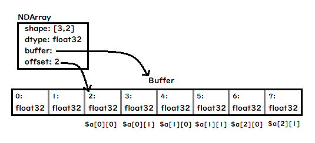

NDArray Interface
-----------------
### Overview
The Rindow Math Matrix provides an N-dimensional array type, the NDArray, which describes a collection of “items” of the same type. The items can be indexed using for example N float values.

All items contained in the NDArray have the same type value. All items are specified by "ArrayAccess", the standard PHP interface. The data type of one value is the integer type, floating point type, or boolean type defined by NDArray.

N-dimensional arrays are mapped to a one-dimensional array buffer and stored as a continuous area.



Most importantly, the NDArray interface is not part of the Rindow framework. **The interfaces are defined independently** and other frameworks can be freely implemented.

```php
use Interop\Polite\Math\Matrix\NDArray;
```

Please see [interop-phpobjects/polite-math](https://github.com/interop-phpobjects/polite-math)

### Methods

#### offsetGet
Items are obtained by "offsetGet" of ArrayAccess interface.

For NDArrays with two or more dimensions, use the "offsetGet" method to return the NDArray type. This implements an N-dimensional array.
At this time, the buffer is not copied but shared by the two NDArrays.

```php
# $a is 2-D array of float32 on NDArray
$b = $a[1];
# $b is 1-D array of float32 on NDArray
if($b instaceof NDArray) {
    echo "b is NDArray\n";
}
if($b[2]==$a[1][2]) {
    echo "Same item\n"
}
# $c is
if(spl_object_id($a->buffer())==spl_object_id($b->buffer())) {
    echo "The buffer is Shared!!\n";
}
```

You can also specify a range for the subscript.The range is specified by PHP array.

Returns the specified range as an NDArray. Buffer is also shared at this time.

```php
# $a is 2-D array of float32 on NDArray
$b = $a[[1,3]];
# $b is 2-D array of float32 NDArray referring 1 to 3
```


#### offsetSet
Set items using offsetSet of ArrayAccess interface.

When using the "offsetSet" method for an NDArray with two or more dimensions, copy the array.
The array to be copied must have the same shape.

```php
# $a is 2-D array of float32 on NDArray shape=[3,2]
# $b is 1-D array of float32 on NDArray shape=[2]
$a[1] = $b;
```

#### offsetExists
"offsetExists" returns the result of the range check because there is always a value within the range of the NDArray array.

#### offsetUnset
You cannot delete the area of an item.

#### shape
Gets the shape of the N-dimensional array defined by NDarray.

```php
$shape = $a->shape();
```

#### ndim
Get the number of dimensions of an array

```php
$ndim = $a->ndim();
```

#### buffer
Get a buffer object.

```php
$buffer = $a->buffer();
```

#### offset
Gets the offset at which the NDArray refers to the buffer object.

```php
$offset = $a->offset();
```

#### size
Get the total number of items in the array. It is not the size of the buffer.

```php
$size = $a->size();
```

#### reshape
Gets the NDArray with the shape of the array changed. Must be the same size as the original array. The buffer is shared.

```php
$reshape = $a->reshape();
```

#### toArray
Convert NDArray to PHP array type.

```php
$array = $a->toArray();
```

### Constants
NDArray has constants to represent its data type.

Various data types are defined for convenience, but not all of them need to be implemented.

- bool
- int8
- int16
- int32
- int64
- uint8
- uint16
- uint32
- uint64
- float8
- float16
- float32
- float64


Buffer object
-------------
### Overview
The buffer object is the area that stores the actual data of the NDArray. Implements a one-dimensional array.
It must implement the standard ArrayAccess interface of PHP and the Countable interface.
Since it is assumed that various implementations will be used, a basic Buffer interface is defined.

One-dimensional arrays can be implemented in any way, but contiguous areas of memory generally make it easier for the CPU to perform fast operations. It is easy to refer to memory areas at the C language level, and it is also easy to exchange data between high-speed calculation libraries.


For these reasons, NDArray uses a one-dimensional array buffer object rather than a PHP array.

### Methods

#### offsetGet
Index must be an integer.
Get the value of an item


#### offsetSet
Index must be an integer.
Set the value of an item

#### offsetExists
Index must be an integer.
Returns whether Index is in range

#### offsetUnset
Index must be an integer.
Set the zero of an item

#### count
Get the number of items. It is not the reserved memory size.
