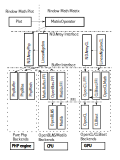

## Overview

"Rindow Math Matrix" is a library that provides a vector operation environment.

It is designed to be similar to Python's NumPy, helping many people save learning time.

It has the following features:

- Implements a common array object interface, "NDArray".
- Provides a flexible N-dimensional array operation library.
- Can use OpenBLAS as an external backend library (optional).
- Enables the use of hardware like GPUs via OpenCL (optional).


## Module Structure

"Rindow Math Matrix" is modularized to support various operating environments.
Each module is replaceable, and new functionalities can be added.

Structure Diagram:




## Requirements

- PHP 8.1, 8.2, 8.3, 8.4
   - (If using in a PHP 7.2 to 8.0 environment, please use release 1.1.)
- Windows 10, 11, or Linux (when using OpenBLAS)


## Recommends

- [**Rindow Math Plot**](/mathematics/plot/overviewplot.html): Visualization of mathematical data
- [**Rindow Matlib and OpenBLAS**](/mathematics/openblas/overviewopenblas.html): C language interface and high-speed computation
- [**OpenCL and CLBlast**](/mathematics/acceleration/opencl.html): Supports GPU acceleration


## Installation

### Installing Rindow Math Matrix
Please set up using composer.

```shell
$ composer require rindow/rindow-math-matrix
```

If graph display is needed, set up rindow-math-plot.

For Windows, enable the GD extension in `php.ini`.
```ini
extension=gd
```
For Linux, install the GD extension.
```shell
$ sudo apt install phpX.X-gd
```

Install rindow-math-plot.
```shell
$ composer require rindow/rindow-math-plot
```

For Linux, image viewer configuration is required for rindow-math-plot.

```shell
$ RINDOW_MATH_PLOT_VIEWER=/some/bin/dir/png-file-viewer
$ export RINDOW_MATH_PLOT_VIEWER
```
Note: Specify something like "viewnior" for `RINDOW_MATH_PLOT_VIEWER`.

### Accelerate with CPU only

First, enable FFI and install external libraries.

**For Windows**:

Enable FFI.
Enable the FFI extension in `php.ini`.
```ini
extension=ffi
```
Confirm that FFI is enabled.
```shell
work> php -m | findstr "FFI"
```

Download and extract the Windows binaries for OpenBLAS from the following site:
- https://github.com/OpenMathLib/OpenBLAS/releases/
Download and extract the Windows binaries for Rindow-Matlib from the following site:
- https://github.com/rindow/rindow-matlib/releases/

Set the respective `bin` directories in your PATH.
```shell
work> SET PATH=%PATH%;C:\path\to\OpenBLAS\bin;C:\path\to\Matlib\bin
```

**For Linux**:

Don't forget to install the FFI extension, OpenBLAS, and LAPACKe using the apt command.
```shell
$ sudo apt install phpX.X-ffi libopenblas0 liblapacke
```
Download and install the Linux binaries for Rindow-Matlib from the following site:
- https://github.com/rindow/rindow-matlib/releases/
```shell
$ wget https://github.com/rindow/rindow-matlib/releases/download/vX.X.X/rindow-matlib_X.X.X_amd64.deb
$ sudo apt install ./rindow-matlib_X.X.X_amd64.deb
```

Install the service for acceleration.
**Common for Windows and Linux**

Please install rindow-math-matrix-matlibffi.
```shell
$ composer require rindow/rindow-math-matrix-matlibffi
```
Confirm the installation.
```shell
$ vendor/bin/rindow-math-matrix
Service Level   : Advanced
Buffer Factory  : Rindow\Math\Buffer\FFI\BufferFactory
BLAS Driver     : Rindow\OpenBLAS\FFI\Blas
LAPACK Driver   : Rindow\OpenBLAS\FFI\Lapack
Math Driver     : Rindow\Matlib\FFI\Matlib
```
If the service level is Basic, external libraries are not available for some reason.
Check with the command's verbose option.
```shell
$ vendor/bin/rindow-math-matrix -v
```

For detailed installation instructions, see [here](/mathematics/openblas/overviewopenblas.html).

### Accelerate with GPU
First, configure the libraries as described in the previous section "Accelerate with CPU only".
Then, install the GPU acceleration library.

**For Windows**:

Download and extract the Windows binaries for CLBlast from the following site:
- https://github.com/CNugteren/CLBlast/releases

Set the `bin` directory in your PATH.
```shell
work> SET PATH=%PATH%;C:\path\to\CLBlast\bin
```

**For Linux**:
Install OpenCL and CLBlast.
OpenCL drivers vary for each hardware.
Standard Ubuntu provides the following:
- **For Intel iGPU**: `intel-opencl-icd`
- **For AMD APU**: `mesa-opencl-icd`
Other GPUs require drivers specific to their manufacturers.

```shell
$ sudo apt install clinfo
$ sudo apt install XXX-XXX-icd  # Replace XXX-XXX-icd with your specific OpenCL ICD loader
$ sudo apt install libclblast0
```

Confirm that the service level becomes "Accelerated" using the command.
**Common for Windows and Linux**
```shell
$ vendor/bin/rindow-math-matrix
Service Level   : Accelerated
Buffer Factory  : Rindow\Math\Buffer\FFI\BufferFactory
BLAS Driver     : Rindow\OpenBLAS\FFI\Blas
LAPACK Driver   : Rindow\OpenBLAS\FFI\Lapack
Math Driver     : Rindow\Matlib\FFI\Matlib
OpenCL Factory  : Rindow\OpenCL\FFI\OpenCLFactory
CLBlast Factory : Rindow\CLBlast\FFI\CLBlastFactory
```
If the service level is Basic or Advanced, external libraries are not available for some reason.
Check with the command's verbose option.
```shell
$ vendor/bin/rindow-math-matrix -v
```

For detailed installation instructions, see [here](/mathematics/acceleration/opencl.html)

## How to use Rindow Math Matrix
```php
<?php
include 'vendor/autoload.php';

$mo = new Rindow\Math\Matrix\MatrixOperator();

$a = $mo->array([1.0, 2.0]);
$b = $mo->array([3.0, 4.0]);

$c = $mo->add($a,$b);

echo $mo->toString($c)."\n";

### To create a graph like this:

$plt = new Rindow\Math\Plot\Plot();

$plt->bar(['x','y'],$c);
$plt->show();
```

When using a linear algebra library:
```php
<?php
include 'vendor/autoload.php';

$mo = new Rindow\Math\Matrix\MatrixOperator();
$la = $mo->la();

$a = $mo->array([[1.0, 2.0],[3.0, 4.0]]);
$b = $mo->array([[3.0, 4.0],[5.0, 6.0]]);

$c = $la->gemm($a,$b);

echo $mo->toString($c)."\n";

### To create a graph for this:

$plt = new Rindow\Math\Plot\Plot();

$plt->bar(['x','y'],$c);
$plt->show();
```

When using the GPU version of the linear algebra library:
```php
<?php
include 'vendor/autoload.php';

use Interop\Polite\Math\Matrix\OpenCL;

$mo = new Rindow\Math\Matrix\MatrixOperator();
$la = $mo->laAccelerated('clblast',['deviceType'=>OpenCL::CL_DEVICE_TYPE_GPU]);
$la->blocking(true);

$a = $mo->array([[1.0, 2.0],[3.0, 4.0]]);
$b = $mo->array([[3.0, 4.0],[5.0, 6.0]]);

// Move arrays to GPU memory
$a_gpu = $la->array($a);
$b_gpu = $la->array($b);

// Perform operation on GPU
$c_gpu = $la->gemm($a_gpu,$b_gpu);

// Move result back to host NDArray
$c = $la->toNDArray($c_gpu);

echo $mo->toString($c)."\n";

### To create a graph for this:

$plt = new Rindow\Math\Plot\Plot();

$plt->bar(['x','y'],$c);
$plt->show();
```
