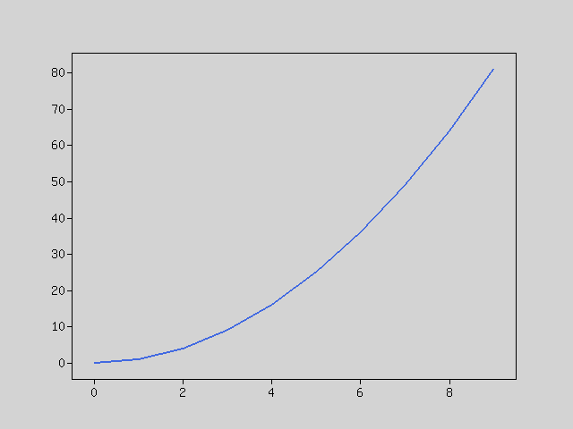

Components
----------
Before we start using Rindow Math Plot, we will explain the components and their role.

It has the following components:
- **Plot**:
    - Main component of Rindow Math Plot. Perform the operation of each component from here.
- **Figure**:
    - Rindow Math Plot graphs data against "Figure".
- **Axes**:
    - "Figures" are separated by one or more "Axes".
- **Artist**:
    - When a graphing instruction is given, "Artist" is created from data and placed in the axes.
- **Renderer**:
    - Finally, if you give a drawing instruction, "Renderer" will do the drawing. The currently supported renderer, GDDriver, outputs png images.


Simple usage
------------
Let's draw a quadratic curve.

First, let's create an instance of MatrixOperator and Plot.
```php
$mo = new Rindow\Math\Matrix\MatrixOperator();
$plt = new Rindow\Math\Plot\Plot(null,$mo);
```

Create NDArray type quadratic curve data.
Only NDArray type data can be input in Plot.
```php
$x = $mo->op($mo->arange(10),'**',2);
```

Plot the data. An implicit figure and axis are created,
and a line graph is plotted there.
```php
$plt->plot($x);
```

When a drawing instruction is given, it is output as image data and the viewer of the image file is started.
```php
$plt->show();
```




Decoration
----------
Let's decorate the graph.
There are several parts that decorate the figure (Exactly for each "Axes").

- **frame**:
    - Rendered by default. The rectangular frame outside the graph.
    - "X ticks", "x ticks labels", "y ticks", "y ticks labels" are automatically scaled and drawn in the frame.
- **title**:
    - You can add a title to the chart.
- **x axis label**:
    - You can add a title to the x-axis.
- **y axis label**:
    - You can add a title to the y-axis.
- **legend**:
    - You can attach a legend to the graph.

```php
$x = $mo->arange(11);
$data0 = $mo->op($x,'*',2);
$data1 = $mo->op(25,'-',$mo->op($mo->op($x,'-',5),'**',2));
$plt->plot($x,$data0,null,'x*2');
$plt->plot($x,$data1,null,'25-x^2');
$plt->legend();
$plt->title('sample');
$plt->xlabel('X label');
$plt->ylabel('Y label');
$plt->show();
```


Subplots
--------
A figure can contain multiple graphs.
If you want to split inside the figure, use subplots method.
The figure and axes are returned, so you can draw a graph by plotting each axes.

```php
$x = $mo->arange(11);
[$fig,$axes] = $plt->subplots(2,2);
$data0 = $mo->op($x,'*',2);
$data1 = $mo->op(25,'-',$mo->op($mo->op($x,'-',5),'**',2));
$data2 = $mo->op($mo->op($x,'-',5),'**',3);
$data3 = $mo->op(10,'-',$x);
$axes[0]->plot($x,$data0);
$axes[1]->bar($x,$data1);
$axes[2]->scatter($x,$data2);
$axes[3]->barh($x,$data3);
$plt->show();
```


Artists
-------
The data chart is drawn by combining "Artist".

For example, there are the following artists:

- Line2D
- Bar
- Marker
- Wedge
- Image

These are created and registered in the axes by methods that graph the data.
Also, it is returned as the return value of those methods and used for the legend method etc.

```php
$x = $mo->arange(11);
$data0 = $mo->op(25,'-',$mo->op($mo->op($x,'-',5),'**',2));
$data1 = $mo->op(10,'-',$x);
$data2 = $mo->op($x,'*',2);
$data3 = $mo->op($mo->op($mo->op($mo->op($x,'-',5),'**',3),'/',12.5),'+',10);
$artists = [];
$artists = array_merge($artists,$plt->bar($x,$data0));
$artists = array_merge($artists,$plt->barh($x,$data1));
$artists = array_merge($artists,$plt->plot($x,$data2));
$artists = array_merge($artists,[$plt->scatter($x,$data3)]);
$plt->legend($artists,['x**2','-x','x*2','x**3']);
$plt->show();
```


Drawing charts
--------------
### Line graph
Use the "plot" method.

If data of x and y coordinates is given or only y coordinate is given, x coordinate is automatically assigned to each data.

```php
[$fig,$axes] = $plt->subplots(2);
$x = $mo->array([0, 0.2, 0.4, 0.6, 0.8, 1.0]);
$y = $mo->op($x,'**',2);
$axes[0]->plot($x,$y,null,'x,y');
$axes[0]->legend();
$axes[1]->plot($y,null,null,'y');
$axes[1]->legend();
$plt->show();
```


If multiple data of one coordinate array are included, draw multiple lines.
Same behavior as using the plot method multiple times.

```php
$x = $mo->array([0, 0.2, 0.4, 0.6, 0.8, 1.0]);
$y = $mo->array([
    [0.0,0.0], [0.3,3.0], [0.7,4.0], [1.2,3.0], [2.8,1.0], [5.0,0.0]
]);
$lines = $plt->plot($x,$y);
$plt->legend($lines,['data0','data1']);
$plt->show();
```


### Bar charts
Use the "bar" or "barh" method.

When data x and height are given to "bar", data x is interpreted as a data label and a bar chart is drawn.

The same goes for "barh".

```php
[$fig,$axes] = $plt->subplots(2);
$x = ['apple','orange','banana','pear','strawberry'];
$y = $mo->array([2,3,5,4,2]);
$axes[0]->bar($x,$y);
$axes[1]->barh($x,$y);
$plt->show();
```


If the array contains multiple sets of data, draw a stacked bar chart

```php
$x = ['apple','orange','banana','pear','strawberry'];
$y = $mo->array([
    [0.1,0.1], [0.3,3.0], [0.7,4.0], [1.2,3.0], [2.8,1.0]
]);
$bars = $plt->bar($x,$y);
$plt->legend($bars,['data0','data1']);
$plt->show();
```


Sometimes you want to draw a grouped bar chart. That's a bit complicated.

This can be realized by giving x coordinates instead of labels to x.

```php
$labels = ['apple','orange','banana','pear','strawberry'];
$x = $mo->arange(5);
$data0 = $mo->array([20, 34, 30, 35, 27]);
$data1 = $mo->array([25, 32, 34, 20, 25]);
$width = 0.35;
$plt->bar($mo->op($x,'-',$width/2),$data0, $width,null,'data0');
$plt->bar($mo->op($x,'+',$width/2),$data1, $width,null,'data1');
$plt->xticks($x,$labels);
$plt->legend();
$plt->show();
```


### Scatter plot
Use the "scatter" method. Given x and y coordinates.

You can give the size if you need.

```php
$x = $mo->random()->randn([1000]);
$y = $mo->random()->randn([1000]);
$size = $mo->op($mo->random()->rand([1000]),'*',30);
$plt->scatter($x,$y,$size);
$plt->show();
```


### Pie chart
Use the "pie" method.

The pie chart is drawn according to the ratio of the given data.

If it is a general pie chart, give a label. It is better to specify the start position to be 90.

If you want to calculate and display percentages automatically, give sprintf format.

Sometimes you want to explode a pie. In that case, please give a numerical value.

```php
$x = $mo->array([2, 3, 5, 4, 2]);
$labels = ['apple','orange','banana','pear','strawberry'];
$explode = [0, 0, 0.1, 0, 0];
$plt->pie($x,$labels,90,'%1.1f%%',$explode);
$plt->show();
```


Sometimes you want to make the numbers in a pie a direct number instead of a percentage. In that case, specify the function.

```php
$x = $mo->array([2, 3, 5, 4, 2]);
$labels = ['apple','orange','banana','pear','strawberry'];
$func = function($x) {
    return sprintf('%d',$x);
};
$plt->pie($x,$labels,90,$func);
$plt->show();
```


### Heat map
Use the "imshow" and "colorbar" method.

"imshow" displays the data of the two-dimensional array in different colors by colormap.

"colorbar" shows the scale of the displayed color.


```php
$fn = fn($x) => 1/sqrt(2*pi())*exp(-$x*$x/2);
$x1 = $mo->f($fn,$mo->arange(100,-5.0, 0.08));
$x2 = $mo->f($fn,$mo->arange(100,-3.0, 0.08));
$z1 = $mo->la()->multiply($x1,$mo->la()->multiply($x1,$mo->ones([100,100])),true);
$z2 = $mo->la()->multiply($x2,$mo->la()->multiply($x2,$mo->ones([100,100])),true);
$z = $mo->op($z1,'-',$z2);

$img = $plt->imshow($z,null,null,[-4,4,-4,4]);
$plt->colorbar($img);
$plt->show();
```


