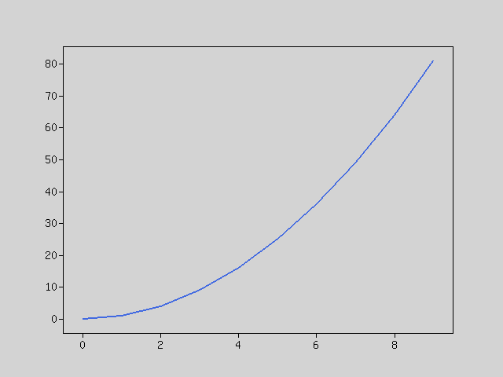

Overview
--------
"Rindow Math Plot" is a visualization library for mathematical data.

It is made to resemble python matplotlib to save time for many people to learn.

It has the following features.

- Visualize data as it is on bar graphs and line graphs
    - The graph types are line, bar, horizontal bar, dot, circle, color bar etc.
- Adjust the scale automatically.
    - Automatic adjustment of X and Y axis scales
- Make multiple graphs into one image

Requirements
------------
- PHP 7.2, 7.3, 7.4, 8.0, 8.1, 8.2.
- GD2 extension

Installation
------------

### Install the Rindow Math Plot

Please set up with composer.

```shell
$ composer require rindow/rindow-math-plot
```

Add extension configuration to php.ini
```shell
extension=gd2
or
extension=gd
```

In the case of Linux, explicitly set the viewer that displays png in the environment variable.
```shell
RINDOW_MATH_PLOT_VIEWER=/some/tool/pngviewer
export RINDOW_MATH_PLOT_VIEWER
```

Quickstart
----------
Displays a simple graph.

```php
$mo = new Rindow\Math\Matrix\MatrixOperator();
$plt = new Rindow\Math\Plot\Plot(null,$mo);
$x = $mo->op($mo->arange(10),'**',2);
$plt->plot($x);
$plt->show();
```


