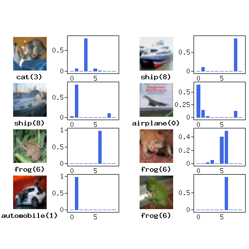
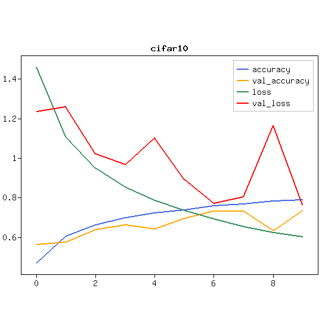
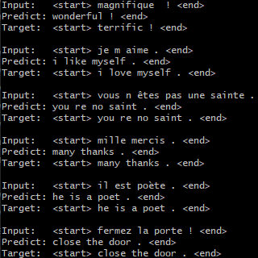

  

    

      <!--svg class="bd-placeholder-img rounded-circle" width="140" height="140" xmlns="http://www.w3.org/2000/svg" preserveAspectRatio="xMidYMid slice" focusable="false" role="img" aria-label="Placeholder: 140x140"><title>Placeholder</title><rect width="100%" height="100%" fill="#777"/><text x="50%" y="50%" fill="#777" dy=".3em">140x140</text></svg -->
      
      <h3>Easy to build</h3>
      
This is a high-dimensional neural network library that allows you to easily build a model by combining abundant DNN, CNN, RNN, Attention and other components.

    
<!-- /.col-lg-4 -->
    

      <!--svg class="bd-placeholder-img rounded-circle" width="140" height="140" xmlns="http://www.w3.org/2000/svg" preserveAspectRatio="xMidYMid slice" focusable="false" role="img" aria-label="Placeholder: 140x140"><title>Placeholder</title><rect width="100%" height="100%" fill="#777"/><text x="50%" y="50%" fill="#777" dy=".3em">140x140</text></svg-->
      
      <h3>Easy to check</h3>
      
Models are easy to train, and peripheral tools are available to graph the learning process of the model.

    
<!-- /.col-lg-4 -->
    

      <!--svg class="bd-placeholder-img rounded-circle" width="140" height="140" xmlns="http://www.w3.org/2000/svg" preserveAspectRatio="xMidYMid slice" focusable="false" role="img" aria-label="Placeholder: 140x140"><title>Placeholder</title><rect width="100%" height="100%" fill="#777"/><text x="50%" y="50%" fill="#777" dy=".3em">140x140</text></svg-->
      
      <h3>Easy Acceleration</h3>
      
PHP extensions that can be as fast as the CPU version of Tensorflow and GPU extensions that work on laptops without NVidia are available.

    
<!-- /.col-lg-4 -->
  
<!-- /.row -->
  

    

        
.

    
<!-- /.col-lg-4 -->
  
<!-- /.row -->

<!-- /.container -->

What is the Rindow Neural Networks
----------------------------------
The Rindow Neural Networks is a high-level neural networks library for PHP.
You can achieve powerful machine learning on PHP.

- You can build machine learning models for DNNs, CNNs, RNNs, and Attentions.
- You can use your knowledge of Python and Keras as it is.
- Samples of popular Computer Vision and natural language processing are available.
- The PHP extension can process data twice as fast as the tensorflow CPU version.
- You don't need a dedicated machine learning environment. It can be done on an inexpensive laptop.
- Comes with interesting sample programs.

The goal is to make it easy to write machine learning models on PHP, just like Keras on Python.

If you use the rindow_openblas php extension,
you get can calculate at speed close to CPU version of tensorflow.
The trained model trained on your laptop is available on general web hosting.
You can also benefit from deep learning on popular PHP web hosting services.

It supports GPU acceleration using OpenCL with rindow_clblas and rindow_opencl. You can take advantage of the integrated GPUs in cheap laptops.

It has the following features.

- A high-level neural networks description
- Cooperation with high-speed operation library
- Designing for scalability of operation library
- To save developers the time to learn how to use this library, we adopt an interface similar to Keras.

Rindow Neural Networks usually work with:

- Rindow Math Matrix: scientific matrix operation library
- Rindow OpenBLAS extension: PHP extension of OpenBLAS
- Rindow Math Plot: Visualize machine learning results
- Rindow OpenCL extension: PHP extension of OpenCL operating
- Rindow CLBlast extension: PHP extension of BLAS on GPU (OpenCL)

Sample programs
---------------

  

    

      <!--svg class="bd-placeholder-img rounded-circle" width="140" height="140" xmlns="http://www.w3.org/2000/svg" preserveAspectRatio="xMidYMid slice" focusable="false" role="img" aria-label="Placeholder: 140x140"><title>Placeholder</title><rect width="100%" height="100%" fill="#777"/><text x="50%" y="50%" fill="#777" dy=".3em">140x140</text></svg -->
      
    
<!-- /.col-lg-4 -->
    

      <!--svg class="bd-placeholder-img rounded-circle" width="140" height="140" xmlns="http://www.w3.org/2000/svg" preserveAspectRatio="xMidYMid slice" focusable="false" role="img" aria-label="Placeholder: 140x140"><title>Placeholder</title><rect width="100%" height="100%" fill="#777"/><text x="50%" y="50%" fill="#777" dy=".3em">140x140</text></svg-->
      
    
<!-- /.col-lg-4 -->
    

      <!--svg class="bd-placeholder-img rounded-circle" width="140" height="140" xmlns="http://www.w3.org/2000/svg" preserveAspectRatio="xMidYMid slice" focusable="false" role="img" aria-label="Placeholder: 140x140"><title>Placeholder</title><rect width="100%" height="100%" fill="#777"/><text x="50%" y="50%" fill="#777" dy=".3em">140x140</text></svg-->
      
    
<!-- /.col-lg-4 -->
  
<!-- /.row -->

<!-- /.container -->

- Images basic classification with Full-connected Neural Networks(FNN)
- Images classification with Convolution Neural Networks(CNN)
- Numeric addition text generation with Recurrent Neural Networks(RNN)
- Neural machine language translation with Attention(RNN with Attention)

Tutorials
---------
We plan to create step-by-step tutorials.

See the [Machine learning tutorials on PHP](tutorials/tutorials.html) page.

- [Basic image clasification](tutorials/basic-image-classification.html)
- [Convolutional Neural Network(CNN)](tutorials/convolution-neural-network.html)
- [Learning to add numbers with seq2seq on PHP](tutorials/learn-add-numbers-with-rnn.html)
- [Neural machine translation with attention on PHP](tutorials/neural-machine-translation-with-attention.html)

Why do deep learning with PHP?
------------------------------

> - "If you do deep learning, you should use Python."
> - "You should study Python anyway!"
> - "Isn't Python an excellent Deep learning framework?"

What you say is right.

So why do we have to use Python?

Do you need to be platform constrained for deep learning?
Never need!

Deep learning / ML is only a small part of the whole system. It's just a small group of functions in the library.
Everyone should be able to use it anywhere, as much as print "Hello!".

It is more unnatural to not be able to use PHP.

Requirements
------------

- PHP 8.0. 8.1 8.2(If you want to use it on PHP 7.x, please use Version 1.x.)
- Windows or Linux environment is required to use rindow_openblas extension.
- Rindow Math Matrix

Recommends
----------

- Rindow Math Plot ( Display the result on a graph )
- GD / GD2  extension ( Used for graph display )
- pdo_sqlite extension ( Used to save the trained model )
- Rindow OpenBLAS extension ( Used for high-speed calculation )
- Rindow OpenCL extension  / Rindow CLBlast extension  ( Windows only )

Release Notes
-------------
The release notes are below

- [Rindow Neuralnetworks](https://github.com/rindow/rindow-neuralnetworks/releases)
- [Rindow Math Matrix](https://github.com/rindow/rindow-math-matrix/releases)
- [Rindow OpenBLAS](https://github.com/rindow/rindow-openblas/releases)

Note
----
This neural network library has just begun. I understand that it is still lacking. Please have mercy.

Currently, Rindow Neural Networks does not support the Rindow framework. Manage the life cycle of an object in a stand-alone manner as in normal PHP programming. It will be available on the Rindow framework in the future.

This text is written using machine translation. We hope that  native English speakers will be able to help you correct the text.
