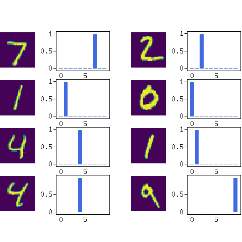

  

    

      <!--svg class="bd-placeholder-img rounded-circle" width="140" height="140" xmlns="http://www.w3.org/2000/svg" preserveAspectRatio="xMidYMid slice" focusable="false" role="img" aria-label="Placeholder: 140x140"><title>Placeholder</title><rect width="100%" height="100%" fill="#777"/><text x="50%" y="50%" fill="#777" dy=".3em">140x140</text></svg -->
      
      <h3>Easy to build</h3>
      
A high-dimensional neural network library that allows you to easily build models by combining rich components such as DNN, CNN, RNN, and (multi-head) Attention.

    
<!-- /.col-lg-4 -->
    

      <!--svg class="bd-placeholder-img rounded-circle" width="140" height="140" xmlns="http://www.w3.org/2000/svg" preserveAspectRatio="xMidYMid slice" focusable="false" role="img" aria-label="Placeholder: 140x140"><title>Placeholder</title><rect width="100%" height="100%" fill="#777"/><text x="50%" y="50%" fill="#777" dy=".3em">140x140</text></svg-->
      
      <h3>Easy to check</h3>
      
Training models is simple, and you can use peripheral tools to graph the learning process.

    
<!-- /.col-lg-4 -->
    

      <!--svg class="bd-placeholder-img rounded-circle" width="140" height="140" xmlns="http://www.w3.org/2000/svg" preserveAspectRatio="xMidYMid slice" focusable="false" role="img" aria-label="Placeholder: 140x140"><title>Placeholder</title><rect width="100%" height="100%" fill="#777"/><text x="50%" y="50%" fill="#777" dy=".3em">140x140</text></svg-->
      
      <h3>Easy to Accelerate</h3>
      
PHP FFI with speeds comparable to TensorFlow's CPU version and GPU acceleration that works without NVidia are available.

    
<!-- /.col-lg-4 -->
  
<!-- /.row -->
  

    

        
.

    
<!-- /.col-lg-4 -->
  
<!-- /.row -->

<!-- /.container -->

What is the Rindow Neural Networks
----------------------------------
Rindow Neural Networks is a high-level neural network library for PHP.
It enables powerful machine learning in PHP.

- You can build machine learning models such as DNN, CNN, RNN, and attention.
- You can leverage your knowledge of Python and Keras.
- Popular computer vision and natural language processing samples are available.
- By calling high-speed computation libraries, you can process data at speeds comparable to TensorFlow's CPU version.
- No dedicated machine learning environment is required. It can run on inexpensive laptops.
- Interesting sample programs are included.

The goal is to make it easy to create machine learning models in PHP using a method similar to Keras in Python.

Using OpenBLAS and Rindow-Matlib, you can achieve speeds close to TensorFlow's CPU version.
Pre-trained models trained on laptops are available on popular web hosting services.
You can also benefit from deep learning on popular PHP web hosting services.

We support GPU acceleration using OpenCL and CLBlast. You can take advantage of integrated GPUs in inexpensive laptops. NVidia graphics cards are not required.

Features include:

- High-level neural network description
- Integration with high-speed computation libraries
- Designed with extensibility of computation libraries in mind
- Adopts an interface similar to Keras to save developers time learning how to use this library

Rindow Neural Networks typically works in conjunction with:

- Rindow-Matlib: A scientific matrix computation library suitable for machine learning
- OpenBLAS: The most popular high-speed matrix computation library
- Rindow Math Plot: Visualizes machine learning results
- OpenCL: A framework for GPU programming
- CLBlast: BLAS on GPU (OpenCL)

Sample programs
---------------

  

    

      <!--svg class="bd-placeholder-img rounded-circle" width="140" height="140" xmlns="http://www.w3.org/2000/svg" preserveAspectRatio="xMidYMid slice" focusable="false" role="img" aria-label="Placeholder: 140x140"><title>Placeholder</title><rect width="100%" height="100%" fill="#777"/><text x="50%" y="50%" fill="#777" dy=".3em">140x140</text></svg -->
      
    
<!-- /.col-lg-4 -->
    

      <!--svg class="bd-placeholder-img rounded-circle" width="140" height="140" xmlns="http://www.w3.org/2000/svg" preserveAspectRatio="xMidYMid slice" focusable="false" role="img" aria-label="Placeholder: 140x140"><title>Placeholder</title><rect width="100%" height="100%" fill="#777"/><text x="50%" y="50%" fill="#777" dy=".3em">140x140</text></svg-->
      
    
<!-- /.col-lg-4 -->
    

      <!--svg class="bd-placeholder-img rounded-circle" width="140" height="140" xmlns="http://www.w3.org/2000/svg" preserveAspectRatio="xMidYMid slice" focusable="false" role="img" aria-label="Placeholder: 140x140"><title>Placeholder</title><rect width="100%" height="100%" fill="#777"/><text x="50%" y="50%" fill="#777" dy=".3em">140x140</text></svg-->
      
    
<!-- /.col-lg-4 -->
  
<!-- /.row -->

<!-- /.container -->

- Basic image classification with fully connected neural networks (FNN)
- Image classification with convolutional neural networks (CNN)
- Text generation with numerical addition using recurrent neural networks (RNN)
- Neural machine translation with attention (RNN with Attention)
- Neural machine translation with transformer models

Tutorials
---------
Step-by-step tutorials are planned.

Please see the [Machine learning tutorials on PHP](tutorials/tutorials.html) page.

- [Basic Image Classification](tutorials/basic-image-classification.html)
- [Convolutional Neural Networks (CNN)](tutorials/convolution-neural-network.html)
- [Learning Numerical Addition with seq2seq in PHP](tutorials/learn-add-numbers-with-rnn.html)
- [Neural Machine Translation with Attention in PHP](tutorials/neural-machine-translation-with-attention.html)
- [Neural Machine Translation with Transformer in PHP](tutorials/neural-machine-translation-with-transformer.html)

Why Do Deep Learning with PHP?
------------------------------

> - "If you want to do deep learning, you should use Python."
> - “Just learn Python!”
> - "Isn't Python a great environment for machine learning development?"

That's right.

So why can't we use anything other than Python?

Do we need to be restricted to a platform for deep learning?
Absolutely not!

Deep learning/ML is just a part of the whole system. It's just a small set of functions within a library. Anyone can use it anywhere, just like printing "Hello!".

It's unnatural not to be able to use PHP.

Requirements
------------

- PHP 8.1, 8.2, 8.3, 8.4 (Use version 1.x if you want to use PHP 7.x and 8.0)
- Windows 10/11 or Ubuntu 22.04 or Debian 12 or later for using OpenBLAS and Rindow-Matlib
- Rindow Math Matrix

Recommendations
---------------

- Rindow Math Plot (for displaying results in graphs)
- GD / GD2 extension (used for graph display)
- pdo_sqlite extension (used for saving trained models)
- FFI extension (used for high-speed computation)
- OpenBLAS/Rindow-Matlib (used for high-speed computation)
- OpenCL/CLBlast (GPU acceleration)

Release Notes
-------------
The release notes for each are as follows:

- [Rindow Neuralnetworks](https://github.com/rindow/rindow-neuralnetworks/releases)
- [Rindow Math Matrix](https://github.com/rindow/rindow-math-matrix/releases)
- [Rindow Matlib](https://github.com/rindow/rindow-matlib/releases)

Note
----
This neural network library is just getting started. We understand that there are still many missing features. Please bear with us.

Currently, Rindow Neural Networks does not support the Rindow framework. It manages the lifecycle of objects standalone, just like regular PHP programming. In the future, it will be available with the Rindow framework.

This text is written using machine translation. We hope native English speakers will help correct the text.
