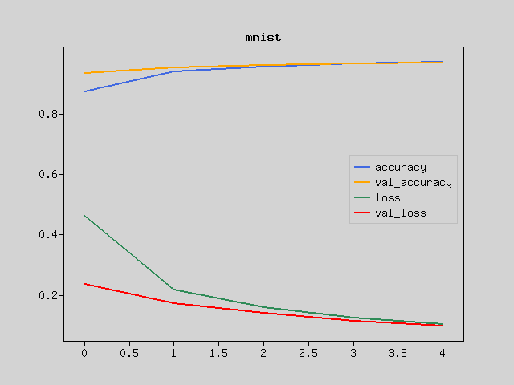

- [Operating environment](#operating-environment)
- [Installation instructions for Windows](#installation-instructions-for-windows)
- [Installation instructions for Ubuntu](#installation-instructions-for-ubuntu)
- [GPU/OpenCL support for Windows](#gpuopencl-support-for-windows)
- [GPU/OpenCL support for Ubuntu](#gpuopencl-support-for-ubuntu)


Operating environment
---------------------
Rindow Neural Networks has been tested in the following operating environments:

・PHP 8.1, 8.2, 8.3 (When using in PHP 7.x, 8.0 environment, please use Release 1.x.)
- Windows 10 20H2 or later.
- Ubuntu 20.04, 22.04
- AMD/Intel CPU/APU 64bit (SSE2 or later)
- OpenBLAS (0.3.20 Windows-x64, 0.3.20 Ubuntu-2204, 0.3.8 Ubuntu-2004)
- CLBlast (1.5.2 or later, Windows-x64, Ubuntu-2204, Ubuntu-2004)

It also works with Intel/AMD CPU/APU and integrated graphics with OpenCL drivers.


Installation instructions for Windows
-------------------------------------
Installing PHP

For Windows 10/11, install PHP for Windows.

+ Download the PHP x64 version from https://windows.php.net/download/. Either Non Thread Safe or Thread Safe version is fine.
+ Extract to a location of your choice.
+ Create php.ini by copying php.ini-development.
+ Set execution PATH for PHP.EXE.
+ Make sure PHP works with PHP -v.

```shell
C:TEMP>COPY C:\php\php.ini-development C:\php\php.ini
Edit php.ini to your liking.

C:TEMP>PATH %PATH%;C:\php
C:TEMP>php -v
PHP 8.3.4 (cli) (built: Mar 13 2024 11:42:47) (NTS Visual C++ 2019 x64)
Copyright (c) The PHP Group
Zend Engine v4.3.4, Copyright (c) Zend Technologies
    with Zend OPcache v8.3.4, Copyright (c), by Zend Technologies
C:TEMP>
```

Install composer.

+ Download composer from https://getcomposer.org/download/.
+ Copy composer.phar to the directory where the execution PATH is set.
+ Create composer.bat in the same location.

```shell
C:TEMP>COPY composer.phar C:\bin
C:TEMP>CD \bin
C:bin>echo @php "%~dp0composer.phar" %*>composer.bat
```

Install the PHP extensions required by Rindow Neural Networks.

+ Download and unzip the corresponding pre-built binary file from https://github.com/xianyi/OpenBLAS/releases.
+ Download and unzip the corresponding pre-built binary file from https://github.com/rindow/rindow-matlib/releases.
+ Set the OpenBLAS and Rindow-Matlib DLL paths to the execution path.
+ Make the necessary settings in php.ini.
      - memory_limit = 8G
      - extension = ffi
      - extension=gd
      - extension = mbstring
      - extension=openssl
      - extension=pdo_sqlite
      - extension=zip
+ Make sure PHP extensions are loaded with PHP -m.

```shell
C:TEMP>PATH %PATH%;C:\OpenBLAS\OpenBLAS-0.3.26-x64\bin
C:TEMP>PATH %PATH%;C:\Matlib\rindow-matlib-1.0.0-win64\bin

Edit php.ini

C:TEMP>php -m
[PHP Modules]
...
ffi
...
pdo_sqlite
...
C:TEMP>
```

Install Rindow Neural Networks.

+ Create your project directory.
+ Install rindow/rindow-neuralnetworks with composer.
+ Install rindow/rindow-math-matrlix-matlibffi with composer to speed up.
+ Install rindow/rindow-math-plot with composer for graph display.
+ Verify that the state of rindow-math-matrlix is Advanced or Accelerated.

```shell
C:TEMP>MKDIR \tutorials
C:TEMP>CD \tutorials
C:tutorials>composer require rindow/rindow-neuralnetworks
C:tutorials>composer require rindow/rindow-matrlix-matlibffi
C:tutorials>composer require rindow/rindow-math-plot
C:tutorials>vendor/bin/rindow-math-matrix
Service Level   : Advanced
Buffer Factory  : Rindow\Math\Buffer\FFI\BufferFactory
BLAS Driver     : Rindow\OpenBLAS\FFI\Blas
LAPACK Driver   : Rindow\OpenBLAS\FFI\Lapack
Math Driver     : Rindow\Matlib\FFI\Matlib
```

Run the sample program

+ Run the sample to see if it works.
+ The results are displayed graphically.

```shell
C:tutorials>MKDIR samples
C:tutorials>CD samples
C:tutorials\samples>COPY ..\vendor\rindow\rindow-neuralnetworks\samples\* .
C:tutorials\samples>php mnist-basic-clasification.php
Downloading train-images-idx3-ubyte.gz ...Done
....
Epoch 4/5 [.........................] 1 sec. remaining:00:00  - 2 sec.
 loss:0.1264 accuracy:0.9640 val_loss:0.1246 val_accuracy:0.9604
Epoch 5/5 [.........................] 1 sec. remaining:00:00  - 2 sec.
 loss:0.1054 accuracy:0.9698 val_loss:0.1129 val_accuracy:0.9675

The graph is displayed
```

Installation instructions for Ubuntu
-----------------------------------------
Install php.

+ Install php-cli, php-mbstring, and unzip using the apt command.

```shell
$ sudo apt install php-cli8.3 php8.3-mbstring php8.3-curl php8.3-sqlite3 php8.3-gd php8.3-xml php8.3-opcache unzip
$ php -v
PHP 8.3.4 (cli) (built: Mar 16 2024 08:40:08) (NTS)
Copyright (c) The PHP Group
Zend Engine v4.3.4, Copyright (c) Zend Technologies
    with Zend OPcache v8.3.4, Copyright (c), by Zend Technologies
```

Install composer.

+ Download composer from https://getcomposer.org/download/.
+ Copy composer.phar to the directory where the execution PATH is set.
+ Make composer in the same place.

```shell
$ cp composer.phar ~/.local/bin
$ cd ~/.local/bin
$ cat > composer
#!/usr/bin/env sh
dir=$(cd "${HOME}/.local/bin" && pwd)
php "${dir}/composer.phar" "$@"
^D
$ chmod +x composer
$ composer -V
Composer version 2.6.6 2023-12-08 18:32:26
```

Install the libraries required by Rindow NeuralNetworks.

+ Install OpenBLAS with apt command
+ Download the latest version of Rindow-Matlib's pre-built binary files from https://github.com/rindow/rindow-matlib/releases.
+ Install the downloaded deb file using the apt command.
+ Set Rindow-Matlib to serial mode for use with PHP.

```shell
$ sudo apt install libopenblas-base liblapacke
$ wget https://github.com/rindow/rindow-matlib/releases/download/X.X.X/rindow-matlib_X.X.X_amd64.deb
$ sudo apt install ./rindow-matlib_X.X.X_amd64.deb
$ sudo update-alternatives --config librindowmatlib.so
There are 2 choices for the alternative librindowmatlib.so (providing /usr/lib/librindowmatlib.so).

  Selection    Path                                             Priority   Status
------------------------------------------------------------
* 0            /usr/lib/rindowmatlib-openmp/librindowmatlib.so   95        auto mode
  1            /usr/lib/rindowmatlib-openmp/librindowmatlib.so   95        manual mode
  2            /usr/lib/rindowmatlib-serial/librindowmatlib.so   90        manual mode

Press <enter> to keep the current choice[*], or type selection number: 2
```

Install Rindow Neural Networks.

+ Set the image display command for rindow-math-plot.
+ Create your project directory.
+ Install rindow/rindow-neuralnetworks with composer.
+ Install rindow/rindow-math-matrix-matlibffi with composer to speed up.
+ Install rindow/rindow-math-plot with composer for graph display.
+ Verify that the state of rindow-math-matrlix is Advanced or Accelerated.


```shell
$ RINDOW_MATH_PLOT_VIEWER=/some/bin/dir/png-file-viewer
$ export RINDOW_MATH_PLOT_VIEWER
$ mkdir ~/tutorials
$ cd ~/tutorials
$ composer require rindow/rindow-neuralnetworks
$ composer require rindow/rindow-math-plot
$ vendor/bin/rindow-math-matrix
Service Level   : Advanced
Buffer Factory  : Rindow\Math\Buffer\FFI\BufferFactory
BLAS Driver     : Rindow\OpenBLAS\FFI\Blas
LAPACK Driver   : Rindow\OpenBLAS\FFI\Lapack
Math Driver     : Rindow\Matlib\FFI\Matlib
```

Run the sample program

+ Run the sample to see if it works.
+ The results are displayed graphically.

```shell
$ mkdir samples
$ cd samples
$ cp ../vendor/rindow/rindow-neuralnetworks/samples/* .
$ php mnist-basic-clasification.php
Downloading train-images-idx3-ubyte.gz ...Done
....
Epoch 4/5 ........................ - 10 sec.
 loss:0.1276 accuracy:0.9641 val_loss:0.1162 val_accuracy:0.9649
Epoch 5/5 ........................ - 11 sec.
 loss:0.1063 accuracy:0.9703 val_loss:0.1059 val_accuracy:0.9688
```
Note: Specify "viewnior" etc. for RINDOW_MATH_PLOT_VIEWER

The result is displayed as a graph.




GPU/OpenCL support for Windows
------------------------------
OpenCL can be used by default on Windows.

Please download the CLBlast library and set the execution path.

- [CLBlast library](https://github.com/CNugteren/CLBlast/releases)

```shell
C:TEMP>PATH %PATH%;C:\CLBlast\CLBlast-1.6.2-Windows-x64\bin
```

Configure the rindow-neuralnetworks backend to use OpenCL.

+ Verify that rindow-math-matrix is Accelerated and the OpenCL driver is recognized.
+ Set environment variables to use GPU in rindow-neuralnetworks backend.
+ Run the sample program.

```shell
C:tutorials>vendor\bin\rindow-math-matrix
Service Level   : Accelerated
Buffer Factory  : Rindow\Math\Buffer\FFI\BufferFactory
BLAS Driver     : Rindow\OpenBLAS\FFI\Blas
LAPACK Driver   : Rindow\OpenBLAS\FFI\Lapack
Math Driver     : Rindow\Matlib\FFI\Matlib
OpenCL Factory  : Rindow\OpenCL\FFI\OpenCLFactory
CLBlast Factory : Rindow\CLBlast\FFI\CLBlastFactory

C:tutorials>SET RINDOW_NEURALNETWORKS_BACKEND=rindowclblast::GPU
C:tutorials>cd samples
C:samples>php basic-image-clasification.php
```
Note: RINDOW_NEURALNETWORKS_BACKEND can specify an OpenCL device type or a set of platform ID and device ID in addition to a name such as rindowclblast. If you have two or more GPUs, you can use this specification method to identify them. for example;

- rindowclblast       => platform #0, device #0
- rindowclblast::GPU  => GPU type device: Integrated GPU, etc.
- rindowclblast::CPU  => CPU type device: pocl-opencl-icd, etc.
- rindowclblast::0,0  => platform #0, device #0
- rindowclblast::0,1  => platform #0, device #1
- rindowclblast::1,0  => platform #1, device #0

If you are unable to successfully set the target GPU, please check the OpenCL device status using the clinfo command.

```shell
C:tutorials>vendor\bin\clinfo
Number of platforms(1)
Platform(0)
    CL_PLATFORM_NAME=Intel(R) OpenCL
    CL_PLATFORM_PROFILE=FULL_PROFILE
....
...
..
```


GPU/OpenCL support for Ubuntu
------------------------------
It is essential that OpenCL works properly in the Linux environment.
(That's quite difficult)

Install the OpenCL environment.

```shell
$ sudo apt install clinfo
$ sudo apt install intel-opencl-icd
```
Ubuntu standard OpenCL drivers include:
- mesa-opencl-icd
- beignet-opencl-icd
- intel-opencl-icd
- nvidia-opencl-icd-xxx
- pocl-opencl-icd

The standard Linux OpenCL driver does not work properly, so we deal with it on a case-by-case basis to make it work somehow for each driver and version.

Check that OpenCL is running using the clinfo command.

```shell
$ clinfo
Number of platforms                               1
  Platform Name                                   Intel Gen OCL Driver
  Platform Vendor                                 Intel
....
...
..
```

Download and install the CLBlast library.
Scripts are available for easy download and installation.

+ Check the latest version: [CLBlast library](https://github.com/CNugteren/CLBlast/releases)
+ Copy script
+ Change the version at the beginning of the script
+ Run script and create deb file
+ Install deb file

```shell
$ cp vendor/rindow/rindow-clblast-ffi/clblast-packdeb.sh .
$ vi clblast-packdeb.sh
CLBLASTVERSION=1.6.2   <===== change
$ sh clblast-packdeb.sh
$ sudo apt install ./clblast_X.X.X-1+ubuntuXX.XX_amd64.deb
```

Configure the rindow-neuralnetworks backend to use OpenCL.

+ Verify that rindow-math-matrix is Accelerated and the OpenCL driver is recognized.
+ Set environment variables to use GPU in rindow-neuralnetworks backend.
+ Run the sample program.

```shell
$ vendor\bin\rindow-math-matrix
Service Level   : Accelerated
Buffer Factory  : Rindow\Math\Buffer\FFI\BufferFactory
BLAS Driver     : Rindow\OpenBLAS\FFI\Blas
LAPACK Driver   : Rindow\OpenBLAS\FFI\Lapack
Math Driver     : Rindow\Matlib\FFI\Matlib
OpenCL Factory  : Rindow\OpenCL\FFI\OpenCLFactory
CLBlast Factory : Rindow\CLBlast\FFI\CLBlastFactory

$ RINDOW_NEURALNETWORKS_BACKEND=rindowclblast::GPU
$ export RINDOW_NEURALNETWORKS_BACKEND
$ cd samples
$ php basic-image-clasification.php
```
Note: RINDOW_NEURALNETWORKS_BACKEND can specify an OpenCL device type or a set of platform ID and device ID in addition to a name such as rindowclblast. If you have two or more GPUs, you can use this specification method to identify them. for example;

- rindowclblast       => platform #0, device #0
- rindowclblast::GPU  => GPU type device: Integrated GPU, etc.
- rindowclblast::CPU  => CPU type device: pocl-opencl-icd, etc.
- rindowclblast::0,0  => platform #0, device #0
- rindowclblast::0,1  => platform #0, device #1
- rindowclblast::1,0  => platform #1, device #0

If you are unable to successfully set the target GPU, please check the OpenCL device status using the clinfo command.
