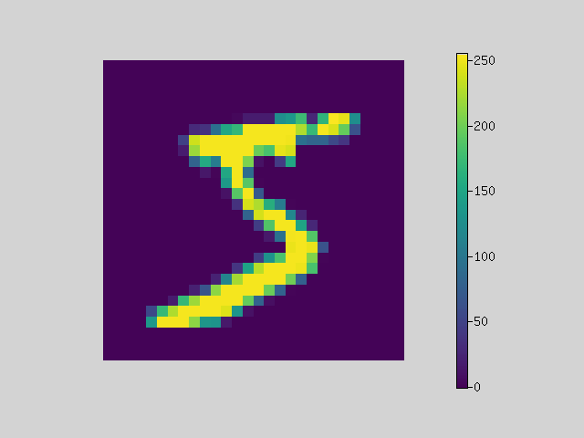
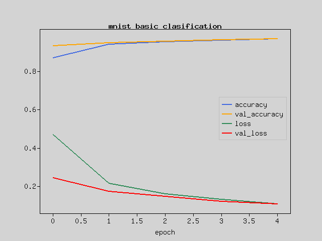
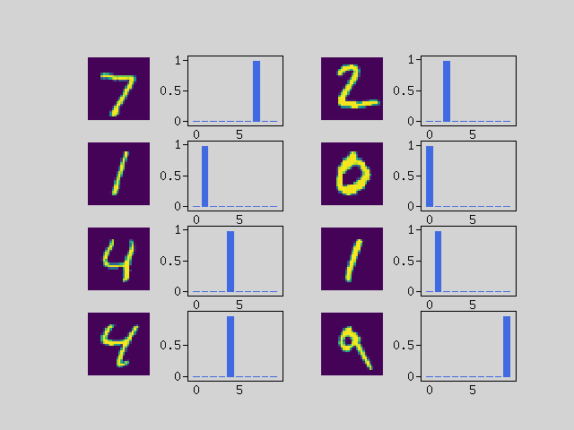

In this tutorial, we will explain the procedure for performing image classification problems by machine learning on PHP.

Advance preparation
-------------------
This tutorial is intended for those who are new to creating neural network models.
It is also intended for people who can program PHP.

It's meant to give you an idea of what Rindow Neural Networks looks like, and doesn't really touch on the details.
Experience the fact that you can create something like "This things works!" On your laptop anyway.

Set up Rindow Neural Networks to work before you start. The installation procedure is
See [Rindow Neural Networks installation](/neuralnetworks/install.md).

Now let's create a model that classifies images of handwritten numbers.


Training data
-------------
Prepare the dataset to be trained first. We will use the MNIST dataset here.
This has been used as an example for a long time and can be easily trained in machine learning.

Rindow Neural Networks has preset datasets that are often used for demonstrations.

Let's prepare the MNIST dataset on PHP.

```php
$mo = new Rindow\Math\Matrix\MatrixOperator();
$nn = new Rindow\NeuralNetworks\Builder\NeuralNetworks($mo);
[[$train_img,$train_label],[$test_img,$test_label]] =
    $nn->datasets()->mnist()->loadData();
echo 'images: '.implode(',',$train_img->shape())."\n";
echo 'labels: '.implode(',',$train_label->shape())."\n";
echo 'test images: '.implode(',',$test_img->shape())."\n";
echo 'test labels: '.implode(',',$test_label->shape())."\n";
# images: 60000,1,28,28
# labels: 60000
# test images: 10000,1,28,28
# test labels: 10000
```

All data is stored in an array called NDArray type.
Unlike PHP native arrays, NDArray has a structure that allows efficient matrix operations.
The MatrixOperator class in the first line is a basic library for general-purpose array operations.
MatrixOperator manipulates this NDArray.

The NeuralNetwork class on the second line is an object builder that creates various objects in Rindow NeuralNetworks.
Programmers do not create objects directly for versatility and future lightweight container support. Create an object via the object builder.

The third line retrieves the actual MNIST dataset.
Calling loadData () will automatically download and cache the data.
After that, it is converted to NDArray type so that it can be handled by PHP, and stored in variables such as $ train_img and $ train_label.

You can see that there are 60,000 training images and labels, and 10,000 verification images and labels.
The image is a 28x28 single color.

Display images
--------------
Let's display the image data. The data is displayed with the first 25 cutout labels.
Rindow Math Plot can display numerical data as an image.

Let's display the image data. Cut out the first 25 pieces of data and display them with the label.
Rindow Math Plot can display numerical data as an image.

```php
$pltCfg = ['title.margin'=>0,];
$plt = new Rindow\Math\Plot\Plot($pltCfg,$mo);
$images = $train_img[[0,24]];
$labels = $train_label[[0,24]];
[$fig,$axes] = $plt->subplots(5,5);
foreach($images as $i => $image) {
    $axes[$i]->setFrame(false);
    $axes[$i]->setTitle(sprintf("'%d'",$labels[$i]));
    $axes[$i]->imshow($image->reshape([28,28]),
        null,null,null,$origin='upper');
}
$plt->show();
```


You can see that the handwritten numbers and the correct numbers are paired.
The basis of supervised machine learning is a method of training a neural network model by giving a large number of images to be discriminated and labels of correct answers.

Data preparation
----------------
Let's take a look at the numbers inside.

```php
$img = $plt->imshow($images[0]->reshape([28,28]),
    null,null,null,$origin='upper');
$plt->colorbar($img);
$plt->getAxes()->setFrame(false);
$plt->show();
echo 'min='.$mo->min($images[0]).',max='.$mo->max($images[0])."\n";
# min=0,max=255
```



You can see that the image data is represented by a numerical value from 0 to 255.

We will convert it to a number from 0 to 1 so that it can be easily handled by the neural network model.
Furthermore, it converts 1x28x28 image data into 784 flat 1D data.

```php
use Interop\Polite\Math\Matrix\NDArray;
$train_img = $mo->scale(1.0/255.0,$mo->astype($train_img,NDArray::float32))
    ->reshape([60000,784]);
$test_img  = $mo->scale(1.0/255.0,$mo->astype($test_img,NDArray::float32))
    ->reshape([10000,784]);
```

The data is now ready.

Creating a model
----------------

The basic component of a neural network model is the layer.
A model is built by stacking layers that have several roles.

A simple model with a straight line of data flow can be built with a sequential model.

```php
$model = $nn->models()->Sequential([
    $nn->layers()->Dense($units=128,
        ['input_shape'=>[784],
            'kernel_initializer'=>'he_normal',
        'activation'=>'relu',
        ]),
    $nn->layers()->Dense($units=10,
        ['activation'=>'softmax']),
]);
```

It is received by the Dense layer, which is a fully connected neuron, and 128 neurons are made to predict the output of the middle layer.
Of course, a neuron that has a random state as a parameter that knows nothing will give an answer randomly, but it will learn later and adjust the state.
This will convert 784 data to 128 data.

Pass the ReLU function to output to the next layer.
This function is called the activation function.
A function that transforms the output so that a neuron fires and distinguishes between active and dormant states as much as possible.

Next, it is received in the Dense layer of fully connected neurons in the output layer and corresponds to 10 neurons.
Again, we initially predict a random answer. From these 128 inputs, you will learn to correspond to 10 numbers.

I want to output with the probability that each of the 10 answers is correct, so I use softmax for the activation function.
softmax distributes to 10 probability numbers so that the total is 1.

Compiling the model
-------------------
Compile the model with the loss function and optimizer.
The loss function sparse_categorical_crossentropy is used when the correct data is an integer label.
The loss function quantifies how far the prediction result is from the correct answer.

Backpropagation is performed from the numerical value of this error, and the parameters of the neuron are updated by going back in the layer.
It is the optimizer that updates it. adam is one of the best optimizers and is often used on modern models.

```php
$model->compile([
    'loss'=>'sparse_categorical_crossentropy',
    'optimizer'=>'adam',
]);
$model->summary();
# Layer(type)                  Output Shape               Param #
# ==================================================================
# Dense(Dense)                 (128)                      100480
# Dense_1(Dense)               (10)                       1290
# ==================================================================
# Total params: 101770
```

From the display of the model summary, you can see that the total number of parameters for each layer is 101770.
Basically, the more parameters you have, the more flexible you can learn.
However, as the number of parameters increases, the amount of calculation increases and the speed slows down, and erroneous learning may become easier, so adjustment is necessary.

Train the model
---------------
Give the model data and train.

```php
$history = $model->fit($train_img,$train_label,
    ['epochs'=>5,'batch_size'=>256,'validation_data'=>[$test_img,$test_label]]);
# Train on 60000 samples, validation on 10000 samples
# Epoch 1/5 ........................ - 13 sec.
#  loss:0.4703 accuracy:0.8711 val_loss:0.2444 val_accuracy:0.9332
# Epoch 2/5 ........................ - 12 sec.
#  loss:0.2149 accuracy:0.9398 val_loss:0.1731 val_accuracy:0.9496
# Epoch 3/5 ........................ - 12 sec.
#  loss:0.1622 accuracy:0.9545 val_loss:0.1481 val_accuracy:0.9551
# Epoch 4/5 ........................ - 11 sec.
#  loss:0.1318 accuracy:0.9622 val_loss:0.1229 val_accuracy:0.9634
# Epoch 5/5 ........................ - 12 sec.
#  loss:0.1096 accuracy:0.9687 val_loss:0.1097 val_accuracy:0.9683
```

Since there are only 60,000 data here, the training is repeated 5 times with the same data.
You can see that learning is progressing each time you repeat.

The batch size specifies how many data to process at one time.
Larger batch sizes are faster but consume memory.
Also, the characteristics of learning will change.

The data specified by validation_data is the data for measuring generalization performance.
If you measure the progress of learning using only the data used for learning, even if you can predict the correct answer in that data, you will not know whether you can make the correct prediction when unknown data appears.
Therefore, we give data that is not used for learning and measure how much the answer is correct.

It is difficult to understand the progress of learning from just a list of numbers, so let's display it on a graph.

```php
$plt->plot($mo->array($history['accuracy']),null,null,'accuracy');
$plt->plot($mo->array($history['val_accuracy']),null,null,'val_accuracy');
$plt->plot($mo->array($history['loss']),null,null,'loss');
$plt->plot($mo->array($history['val_loss']),null,null,'val_loss');
$plt->legend();
$plt->xlabel('epoch');
$plt->title('mnist basic clasification');
$plt->show();
```



As the loss value gradually decreases, the difference between the prediction and the answer becomes smaller.

If the accuracy is 1 in the correct answer rate, all the questions are correct.
This is a graph different from the loss function because the answer with the highest probability of correct answer is used as the predicted value.

Save trained model
------------------
This tutorial is a very simple learning process, so the training time is very short.
However, it takes a very long time to train with the advanced model that is actually used.

If you save the trained model, you can reproduce the trained model just by reading the parameters.

```php
$model->save(__DIR__.'/mnist-basic-model.model',$portable=true);
```

To load the model, just specify the file.

```php
$model = $nn->models()->loadModel(__DIR__.'/mnist-basic-model.model');
```

prediction
----------
Now let's use the trained model to predict handwriting.
The probability of what number the image is is displayed in a graph.

```php
$images = $test_img[[0,7]];
$predicts = $model->predict($images);

$plt->setConfig(['frame.xTickLength'=>0]);
[$fig,$axes] = $plt->subplots(4,4);
foreach ($predicts as $i => $predict) {
    $axes[$i*2]->imshow($images[$i]->reshape([28,28]),
        null,null,null,$origin='upper');
    $axes[$i*2]->setFrame(false);
    $axes[$i*2+1]->bar($mo->arange(10),$predict);
}
$plt->show();
```



You can see that the answer is predicted correctly.
