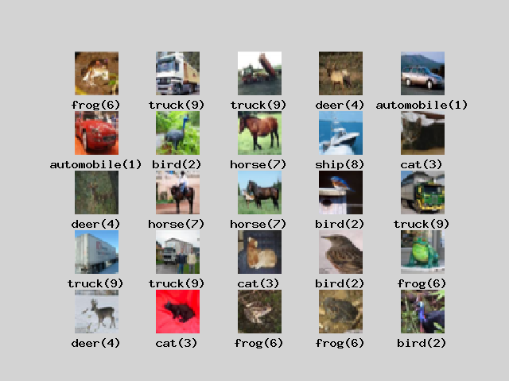
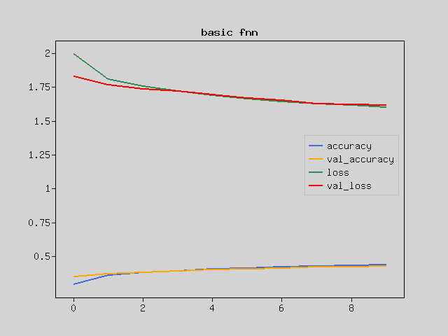
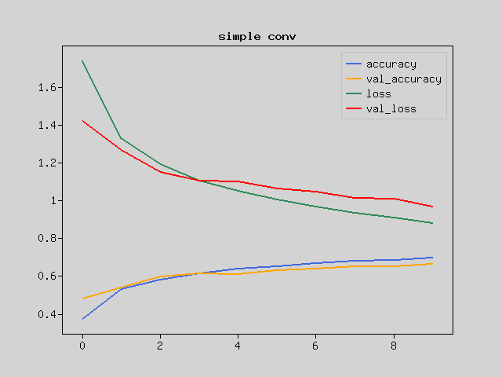
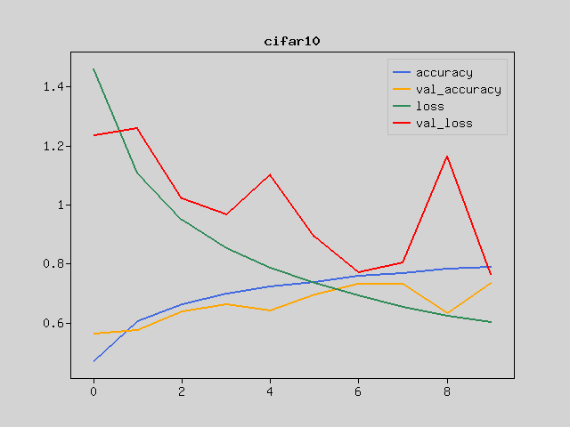
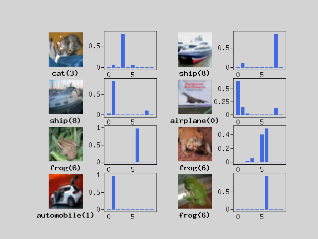

In this tutorial, you will build a simple Convolutional Neural Network(CNN) on PHP using CIFAR10 Image Classification.
Experience how CNN uses images.

Advance preparation
-------------------
Set up Rindow Neural Networks to work before you start. The installation procedure is
See [Rindow Neural Networks installation](/neuralnetworks/install.md).

Experience PHP running fast enough to learn image recognition.
If you are using a Windows environment, we recommend using Rindow CLBlast / OpenCL.

For those who have already completed the [Basic image clasification on PHP] (basic-image-classification.html) tutorial or have equivalent knowledge.

Training data
-------------
The MNIST dataset is too simple to classify images, and current Neural Networks technology makes it too easy to classify.

In comparison, the CIFAR-10 requires a slightly more advanced model.
CIFAR-10 A small color image dataset classified into 10 classes that have been used for a long time.

Let's download and view CIFAR-10 on the Rindow Neural Networks dataset.

```php
include __DIR__.'/../vendor/autoload.php';
$mo = new Rindow\Math\Matrix\MatrixOperator();
$nn = new Rindow\NeuralNetworks\Builder\NeuralNetworks($mo);
[[$train_img,$train_label],[$test_img,$test_label]] =
    $nn->datasets()->cifar10()->loadData();
echo 'images: '.implode(',',$train_img->shape())."\n";
echo 'labels: '.implode(',',$train_label->shape())."\n";
echo 'test images: '.implode(',',$test_img->shape())."\n";
echo 'test labels: '.implode(',',$test_label->shape())."\n";
# images: 50000,32,32,3
# labels: 50000
# test images: 10000,32,32,3
# test labels: 10000
```
You can see that there are 50,000 training images and labels and 10,000 verification images and labels.
The image is 32x32 in three primary colors.

Let's define 10 classes and then look at the image.

```php
$classnames = ['airplane', 'automobile', 'bird', 'cat', 'deer',
               'dog', 'frog', 'horse', 'ship', 'truck'];
$pltCfg = [
    'title.position'=>'down','title.margin'=>0,
];
$plt = new Rindow\Math\Plot\Plot($pltCfg,$mo);
$images = $train_img[[0,24]];
$labels = $train_label[[0,24]];
[$fig,$axes] = $plt->subplots(5,5);
foreach($images as $i => $image) {
    $axes[$i]->imshow($image,
        null,null,null,$origin='upper');
    $label = $labels[$i];
    $axes[$i]->setTitle($classnames[$label]."($label)");
    $axes[$i]->setFrame(false);
}
$plt->show();
```


If you look at the image, you can see that it has a complicated shape unlike the handwritten characters of MNIST.
The outline of the object must also be read from the color image.
Even the same frog has many color variations.

It would be difficult to train them using a simple, flat, fully connected neural network model.

Convert the data type so that the model can be trained.
```php
$f_train_img = $mo->scale(1.0/255.0,$mo->la()->astype($train_img,NDArray::float32));
$f_val_img   = $mo->scale(1.0/255.0,$mo->la()->astype($val_img,NDArray::float32));
$i_train_label = $mo->la()->astype($train_label,NDArray::int32);
$i_val_label   = $mo->la()->astype($val_label,NDArray::int32);
```

The graph below shows the result of training this with the same simple neural network model as the tutorial [Basic image clasification on PHP](basic-image-classification).
```php
$model = $nn->models()->Sequential([
    $nn->layers()->Flatten(['input_shape'=>[32,32,3]]),
    $nn->layers()->Dense($units=128,
        ['kernel_initializer'=>'he_normal',
        'activation'=>'relu']),
    $nn->layers()->Dense($units=10,
        ['activation'=>'softmax']),
]);
$model->compile([
    'loss'=>'sparse_categorical_crossentropy',
    'optimizer'=>'adam',
]);
$model->summary();
# Layer(type)                  Output Shape               Param #
# ==================================================================
# Flatten(Flatten)             (3072)                     0
# Dense(Dense)                 (128)                      393344
# Dense_1(Dense)               (10)                       1290
# ==================================================================
# Total params: 394634

$f_train_img = $mo->la()->astype($train_img,NDArray::float32);
$f_val_img = $mo->la()->astype($val_img,NDArray::float32);
$history = $model->fit($f_train_img,$train_label,
    ['epochs'=>10,'batch_size'=>256,'validation_data'=>[$f_val_img,$val_label]]);
# Train on 50000 samples, validation on 10000 samples
# Epoch 1/10 [.........................] 58 sec. remaining:00:00  - 61 sec.
#  loss:1.9929 accuracy:0.2946 val_loss:1.8269 val_accuracy:0.3504
# Epoch 2/10 [.........................] 48 sec. remaining:00:00  - 51 sec.
#  loss:1.8058 accuracy:0.3631 val_loss:1.7647 val_accuracy:0.3705
# Epoch 3/10 [.........................] 49 sec. remaining:00:00  - 52 sec.
#  loss:1.7587 accuracy:0.3793 val_loss:1.7351 val_accuracy:0.3803
# Epoch 4/10 [.........................] 47 sec. remaining:00:00  - 50 sec.
#  loss:1.7227 accuracy:0.3936 val_loss:1.7179 val_accuracy:0.3903
# Epoch 5/10 [.........................] 48 sec. remaining:00:00  - 51 sec.
#  loss:1.6886 accuracy:0.4057 val_loss:1.6946 val_accuracy:0.3993
# Epoch 6/10 [.........................] 49 sec. remaining:00:00  - 52 sec.
#  loss:1.6649 accuracy:0.4143 val_loss:1.6701 val_accuracy:0.4060
# Epoch 7/10 [.........................] 46 sec. remaining:00:00  - 49 sec.
#  loss:1.6420 accuracy:0.4214 val_loss:1.6543 val_accuracy:0.4131
# Epoch 8/10 [.........................] 49 sec. remaining:00:00  - 52 sec.
#  loss:1.6279 accuracy:0.4300 val_loss:1.6280 val_accuracy:0.4216
# Epoch 9/10 [.........................] 48 sec. remaining:00:00  - 52 sec.
#  loss:1.6167 accuracy:0.4339 val_loss:1.6221 val_accuracy:0.4229
# Epoch 10/10 [.........................] 47 sec. remaining:00:00  - 50 sec.
#  loss:1.6022 accuracy:0.4383 val_loss:1.6182 val_accuracy:0.4267

$plt->setConfig([]);
$plt->plot($mo->array($history['accuracy']),null,null,'accuracy');
$plt->plot($mo->array($history['val_accuracy']),null,null,'val_accuracy');
$plt->plot($mo->array($history['loss']),null,null,'loss');
$plt->plot($mo->array($history['val_loss']),null,null,'val_loss');
$plt->legend();
$plt->title('basic fnn');
$plt->show();
```


I have hardly learned. The same method doesn't seem to work.

Simple Convolutional Neural Networks
------------------------------------
Image data is represented by a three-dimensional array that represents color in addition to height and width. Colors are usually called channels because they use three RGB values, and the colors are represented by three channels.

In the previous model, the input was just a line of this data.

It is necessary to treat it as a plane of image data and make it understood in some way.
Convolutional Neural Networks (CNN) is very effective as a means to process a 2D image as 2D and extract its features.
Let's make a model of CNN.

The Conv2D layer convolves the image data in the height and width directions.
Here, by using a 3x3 kernel and convolving many times, the features on the plane are gradually converted into information in the channel direction (third axis). Let these layers learn how to extract features.

The MaxPooling2D layer simply compresses the image while retaining the features of the planar data. The Pool layer, unlike the Convolutional layer, does not have a kernel (weight parameter).

Let's make a simple network model.
```php
$model = $nn->models()->Sequential([
    $nn->layers()->Conv2D(
        $filters=32,
        $kernel_size=3,
        ['input_shape'=>[32,32,3],
        'kernel_initializer'=>'he_normal',
        'activation'=>'relu']),
    $nn->layers()->MaxPooling2D(),
    $nn->layers()->Conv2D(
        $filters=64,
        $kernel_size=3,
        ['kernel_initializer'=>'he_normal',
        'activation'=>'relu']),
    $nn->layers()->MaxPooling2D(),
    $nn->layers()->Flatten(),
    $nn->layers()->Dense($units=64,
        ['kernel_initializer'=>'he_normal',
        'activation'=>'relu']),
    $nn->layers()->Dense($units=10,
        ['activation'=>'softmax']),
]);
$model->compile([
    'loss'=>'sparse_categorical_crossentropy',
    'optimizer'=>'adam',
]);
$model->summary();
# Layer(type)                  Output Shape               Param #
# ==================================================================
# Conv2D(Conv2D)               (30,30,32)                 896
# MaxPooling2D(MaxPooling2D)   (15,15,32)                 0
# Conv2D_1(Conv2D)             (13,13,64)                 18496
# MaxPooling2D_1(MaxPooling2D) (6,6,64)                   0
# Flatten(Flatten)             (2304)                     0
# Dense(Dense)                 (64)                       147520
# Dense_1(Dense)               (10)                       650
# ==================================================================
# Total params: 167562

$history = $model->fit($f_train_img,$train_label,
    ['epochs'=>10,'batch_size'=>256,'validation_data'=>[$f_val_img,$val_label]]);
# Train on 50000 samples, validation on 10000 samples
# Epoch 1/10 [.........................] 492 sec. remaining:00:00  - 522 sec.
#  loss:1.7411 accuracy:0.3743 val_loss:1.4203 val_accuracy:0.4833
# Epoch 2/10 [.........................] 463 sec. remaining:00:00  - 490 sec.
#  loss:1.3293 accuracy:0.5298 val_loss:1.2694 val_accuracy:0.5414
# Epoch 3/10 [.........................] 461 sec. remaining:00:00  - 488 sec.
#  loss:1.1919 accuracy:0.5815 val_loss:1.1533 val_accuracy:0.5975
# Epoch 4/10 [.........................] 463 sec. remaining:00:00  - 491 sec.
#  loss:1.1068 accuracy:0.6143 val_loss:1.1037 val_accuracy:0.6145
# Epoch 5/10 [.........................] 460 sec. remaining:00:00  - 489 sec.
#  loss:1.0509 accuracy:0.6378 val_loss:1.1026 val_accuracy:0.6102
# Epoch 6/10 [.........................] 458 sec. remaining:00:00  - 486 sec.
#  loss:1.0045 accuracy:0.6518 val_loss:1.0639 val_accuracy:0.6300
# Epoch 7/10 [.........................] 459 sec. remaining:00:00  - 487 sec.
#  loss:0.9666 accuracy:0.6677 val_loss:1.0462 val_accuracy:0.6385
# Epoch 8/10 [.........................] 464 sec. remaining:00:00  - 492 sec.
#  loss:0.9361 accuracy:0.6796 val_loss:1.0131 val_accuracy:0.6535
# Epoch 9/10 [.........................] 459 sec. remaining:00:00  - 486 sec.
#  loss:0.9085 accuracy:0.6859 val_loss:1.0116 val_accuracy:0.6506
# Epoch 10/10 [.........................] 460 sec. remaining:00:00  - 488 sec.
#  loss:0.8805 accuracy:0.6975 val_loss:0.9662 val_accuracy:0.6628
$plt->setConfig([]);
$plt->plot($mo->array($history['accuracy']),null,null,'accuracy');
$plt->plot($mo->array($history['val_accuracy']),null,null,'val_accuracy');
$plt->plot($mo->array($history['loss']),null,null,'loss');
$plt->plot($mo->array($history['val_loss']),null,null,'val_loss');
$plt->legend();
$plt->title('simple conv');
$plt->show();
```


You can see that the learning is progressing compared to the previous result.

But are you satisfied with this? Let's improve it.

Deepen the layer
-----------------
One of the reasons why learning does not proceed is that the model flexibility is low and it is not possible to handle complicated images.

The flexibility of the model is increased by stacking multiple layers. It is more effective than increasing the parameters of one layer.
As the convolution progresses, the area of the image with respect to the plane becomes smaller, so gradually increase the information in the channel direction.
Then, when the plane is sufficiently folded and transformed into long information in the channel direction, the data is converted into straight line information and passed to the fully connected network. Finally, output as 10 classes.

However, it may not be possible to learn well as the layer gets deeper. This is because the features become too large or too small from the first layer to the last layer.
In the Batch Normalization layer, the numerical value is normalized by the standard deviation for each mini-batch to be learned.
This makes it difficult for information to be lost and improves learning efficiency.

Let's write the code for the improved model.
```php
$model = $nn->models()->Sequential([
    $nn->layers()->Conv2D(
        $filters=64,
        $kernel_size=3,
        ['input_shape'=>$inputShape,
        'kernel_initializer'=>'he_normal',]),
    $nn->layers()->BatchNormalization(),
    $nn->layers()->Activation('relu'),
    $nn->layers()->Conv2D(
        $filters=64,
        $kernel_size=3,
        ['kernel_initializer'=>'he_normal',]),
    $nn->layers()->MaxPooling2D(),
    $nn->layers()->Conv2D(
        $filters=128,
        $kernel_size=3,
        ['kernel_initializer'=>'he_normal',]),
    $nn->layers()->BatchNormalization(),
    $nn->layers()->Activation('relu'),
    $nn->layers()->Conv2D(
        $filters=128,
        $kernel_size=3,
        ['kernel_initializer'=>'he_normal',]),
    $nn->layers()->MaxPooling2D(),
    $nn->layers()->Conv2D(
        $filters=256,
        $kernel_size=3,
        ['kernel_initializer'=>'he_normal',
        'activation'=>'relu']),
    $nn->layers()->GlobalAveragePooling2D(),
    $nn->layers()->Dense($units=512,
        ['kernel_initializer'=>'he_normal',]),
    $nn->layers()->BatchNormalization(),
    $nn->layers()->Activation('relu'),
    $nn->layers()->Dense($units=10,
        ['activation'=>'softmax']),
]);

$model->compile([
    'loss'=>'sparse_categorical_crossentropy',
    'optimizer'=>'adam',
]);
$model->summary();
# Layer(type)                  Output Shape               Param #
# ==================================================================
# Conv2D(Conv2D)               (30,30,64)                 1792
# BatchNormalization(BatchNorma(30,30,64)                 128
# Activation(Activation)       (30,30,64)                 0
# Conv2D_1(Conv2D)             (28,28,64)                 36928
# MaxPooling2D(MaxPooling2D)   (14,14,64)                 0
# Conv2D_2(Conv2D)             (12,12,128)                73856
# BatchNormalization_1(BatchNor(12,12,128)                256
# Activation_1(Activation)     (12,12,128)                0
# Conv2D_3(Conv2D)             (10,10,128)                147584
# MaxPooling2D_1(MaxPooling2D) (5,5,128)                  0
# Conv2D_4(Conv2D)             (3,3,256)                  295168
# GlobalAveragePooling2D(Global(256)                      0
# Dense(Dense)                 (512)                      131584
# BatchNormalization_2(BatchNor(512)                      1024
# Activation_2(Activation)     (512)                      0
# Dense_1(Dense)               (10)                       5130
# ==================================================================
# Total params: 693450
```
See the Output Shape section.
You can see that the plane of the 32x32 image is getting smaller and smaller.

On-demand data generation
-------------------------
The next problem that arises as learning progresses is "overfitting." It reacts correctly only to specific data and cannot respond well to unknown data.
Generally, the Dropout layer is used to handle overfitting, but it is not very compatible because the learning efficiency has already been improved with Batch Normalization.
This time, we will deal with overfitting by increasing the variation of sample images.

ImageDataGenerator randomly shifts the input image vertically and horizontally, and randomly flips it horizontally.
Since it changes randomly each time, you can increase the variation of the image in a pseudo manner by giving different input data for each Epoch.

Now let's train the model by giving it data.
```php
echo "training model ...\n";
$train_dataset = $nn->data->ImageDataGenerator($f_train_img,[
    'tests'=>$train_label,
    'batch_size'=>64,
    'shuffle'=>true,
    'height_shift'=>2,
    'width_shift'=>2,
    'vertical_flip'=>true,
    'horizontal_flip'=>true
]);
$history = $model->fit($train_dataset,null,
    ['epochs'=>10,
        'validation_data'=>[$f_val_img,$val_label]]);
$model->save(__DIR__.'/image-classification-with-cnn.model');
# Train on 50000 samples, validation on 10000 samples
# Epoch 1/10 [.........................] 4568 sec. remain:01:23  - 4944 sec.
#  loss:1.4600 accuracy:0.4702 val_loss:1.2344 val_accuracy:0.5614
# Epoch 2/10 [.........................] 4328 sec. remain:01:18  - 4703 sec.
#  loss:1.1075 accuracy:0.6039 val_loss:1.2596 val_accuracy:0.5745
# Epoch 3/10 [.........................] 4301 sec. remain:01:18  - 4676 sec.
#  loss:0.9475 accuracy:0.6635 val_loss:1.0196 val_accuracy:0.6380
# Epoch 4/10 [.........................] 4308 sec. remain:01:18  - 4682 sec.
#  loss:0.8516 accuracy:0.6986 val_loss:0.9672 val_accuracy:0.6630
# Epoch 5/10 [.........................] 4299 sec. remain:01:18  - 4673 sec.
#  loss:0.7869 accuracy:0.7212 val_loss:1.1019 val_accuracy:0.6422
# Epoch 6/10 [.........................] 4296 sec. remain:01:18  - 4680 sec.
#  loss:0.7347 accuracy:0.7387 val_loss:0.8917 val_accuracy:0.6969
# Epoch 7/10 [.........................] 4313 sec. remain:01:18  - 4689 sec.
#  loss:0.6917 accuracy:0.7576 val_loss:0.7697 val_accuracy:0.7322
# Epoch 8/10 [.........................] 4308 sec. remain:01:18  - 4684 sec.
#  loss:0.6544 accuracy:0.7687 val_loss:0.8049 val_accuracy:0.7319
# Epoch 9/10 [.........................] 4298 sec. remain:01:18  - 4673 sec.
#  loss:0.6230 accuracy:0.7819 val_loss:1.1660 val_accuracy:0.6321
# Epoch 10/10 [.........................] 4305 sec. remain:01:18  - 4680 sec.
#  loss:0.6021 accuracy:0.7890 val_loss:0.7638 val_accuracy:0.7357
$plt->setConfig([]);
$plt->plot($mo->array($history['accuracy']),null,null,'accuracy');
$plt->plot($mo->array($history['val_accuracy']),null,null,'val_accuracy');
$plt->plot($mo->array($history['loss']),null,null,'loss');
$plt->plot($mo->array($history['val_loss']),null,null,'val_loss');
$plt->legend();
$plt->tilte('cifar10');
$plt->show();
```


I've learned well with this model.
It doesn't work up to 99% correct answer rate like MNIST, but this model learned CIFAR-10 even with a relatively simple CNN.

prediction
----------
Now let's use the trained model to predict handwriting.

```php
$images = $test_img[[0,7]];
$labels = $test_label[[0,7]];
$predicts = $model->predict($images);

$plt->setConfig([
    'frame.xTickLength'=>0,'title.position'=>'down','title.margin'=>0,]);
[$fig,$axes] = $plt->subplots(4,4);
foreach ($predicts as $i => $predict) {
    $axes[$i*2]->imshow($images[$i]->reshape($inputShape),
        null,null,null,$origin='upper');
    $axes[$i*2]->setFrame(false);
    $label = $labels[$i];
    $axes[$i*2]->setTitle($classnames[$label]."($label)");
    $axes[$i*2+1]->bar($mo->arange(10),$predict);
}
$plt->show();
```



You can see that the answer is generally predicted correctly.
You can see that images that are lost even for humans are lost even for neural networks.
