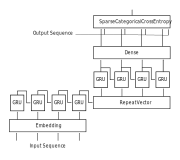
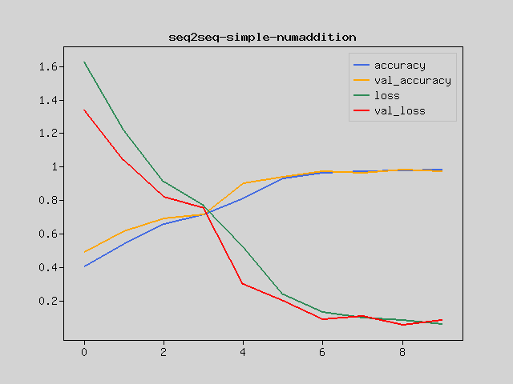

In this tutorial, we will build a model to learn the addition of two numbers using Recurrent Neural Network (RNN) on PHP.

Advance preparation
-------------------
Set up Rindow Neural Networks to work before you start. The installation procedure is
See [Rindow Neural Networks installation](/neuralnetworks/install.md).

Experience that even PHP works fast enough for RNNs.
If you are using a Windows environment, we recommend using Rindow CLBlast / OpenCL.

For those who have already completed the Basic image clasification on PHP tutorial or have equivalent knowledge.

Sequence to sequence learning
-----------------------------
A learning model for converting one numeric sequence to another is called Sequence to sequence learning.

Here, the question of addition is input as a character string, and the answer is output as a character string.

For example

- **Input**: 294+86
- **Output**: 380

If the input is the addition of 3 digits and 3 digits, there will be 1 million ways of input. You can answer by memorizing everything, but that's not interesting.

Numbers have digit information and carry by addition.
It is an attempt to make people understand addition simply by giving questions and answers without teaching these rules.

Training data
-------------
Create a correspondence table that expresses each character numerically so that the learning model can handle it.

```php
$vocab = ['0','1','2','3','4','5','6','7','8','9','+',' ']
```

You have now assigned 12 numbers from '0' to'(space)'.
Input is up to 7 characters and output is up to 4 characters. The sequence of the previous example is as follows.

```php
require __DIR__.'/../vendor/autoload.php';
use Rindow\Math\Matrix\MatrixOperator;
$mo = new MatrixOperator();
$vocab = ['0','1','2','3','4','5','6','7','8','9','+',' '];
$dict  = array_flip($vocab);
$input_seq = $mo->array(array_map(fn($c)=>$dict[$c], str_split('294+86 ')));
$output_seq = $mo->array(array_map(fn($c)=>$dict[$c], str_split('380 ')));
# $input  => [2,9,4,10,8,6,11]
# $output => [3,8,0,11]
```

Prepare a dataset that randomly creates a sequence of such additions and their answers.

```php
use Interop\Polite\Math\Matrix\NDArray;

class NumAdditionDataset
{
    public function __construct($mo,int $corpus_max,int $digits)
    {
        $this->mo = $mo;
        $this->corpus_max = $corpus_max;
        $this->digits = $digits;
        #$this->reverse = $reverse;
        $this->vocab_input  = ['0','1','2','3','4','5','6','7','8','9','+',' '];
        $this->vocab_target = ['0','1','2','3','4','5','6','7','8','9','+',' '];
        $this->dict_input  = array_flip($this->vocab_input);
        $this->dict_target = array_flip($this->vocab_target);
        $this->input_length = $digits*2+1;
        $this->output_length = $digits+1;
    }

    public function dicts()
    {
        return [
            $this->vocab_input,
            $this->vocab_target,
            $this->dict_input,
            $this->dict_target,
        ];
    }

    public function generate()
    {
        $max_num = pow(10,$this->digits);
        $max_sample = $max_num ** 2;
        $numbers = $this->mo->random()->choice(
            $max_sample,$max_sample,$replace=false);
        $questions = [];
        $dups = [];
        $size = 0;
        for($i=0;$i<$max_sample;$i++) {
            $num = $numbers[$i];
            $x1 = (int)floor($num / $max_num);
            $x2 = (int)($num % $max_num);
            if($x1>$x2) {
                [$x1,$x2] = [$x2,$x1];
            }
            $question = $x1.'+'.$x2;
            if(array_key_exists($question,$questions)) {
                #echo $question.',';
                $dups[$question] += 1;
                continue;
            }
            $dups[$question] = 1;
            $questions[$question] = strval($x1+$x2);
            $size++;
            if($size >= $this->corpus_max)
                break;
        }
        unset($numbers);
        $sequence = $this->mo->zeros([$size,$this->input_length],NDArray::int32);
        $target = $this->mo->zeros([$size,$this->output_length],NDArray::int32);
        $i = 0;
        foreach($questions as $question=>$answer) {
            $question = str_pad($question, $this->input_length);
            $answer = str_pad($answer, $this->output_length);
            $this->str2seq(
                $question,
                $this->dict_input,
                $sequence[$i]);
            $this->str2seq(
                $answer,
                $this->dict_target,
                $target[$i]);
            $i++;
        }
        return [$sequence,$target];
    }

    public function str2seq(
        string $str,
        array $dic,
        NDArray $buf)
    {
        $sseq = str_split(strtoupper($str));
        $len = count($sseq);
        $sp = $dic[' '];
        $bufsz=$buf->size();
        for($i=0;$i<$bufsz;$i++){
            if($i<$len)
                $buf[$i]=$dic[$sseq[$i]];
            else
                $buf[$i]=$sp;
        }
    }

    public function seq2str(
        NDArray $buf,
        array $dic
        )
    {
        $str = '';
        $bufsz=$buf->size();
        for($i=0;$i<$bufsz;$i++){
            $str .= $dic[$buf[$i]];
        }
        return $str;
    }

    public function loadData($path=null)
    {
        if($path==null){
            $path='numaddition-dataset.pkl';
        }
        if(file_exists($path)){
            $pkl = file_get_contents($path);
            $dataset = unserialize($pkl);
        }else{
            $dataset = $this->generate();
            $pkl = serialize($dataset);
            file_put_contents($path,$pkl);
        }
        return $dataset;
    }
}
```
It's a bit long code, but now you have a dataset. Let's run it.

Make 20,000 3-digit additions.
```php
$TRAINING_SIZE = 20000;
$DIGITS = 3;
$dataset = new NumAdditionDataset($mo,$TRAINING_SIZE,$DIGITS);
echo "Generating data...\n";
[$questions,$answers] = $dataset->loadData();
$corpus_size = count($questions);
echo "Total questions: ". $corpus_size."\n";
echo "questions[0]:".$mo->toString($questions[0])."\n";
echo "answers[0]  :".$mo->toString($answers[0])."\n";
[$input_voc,$target_voc,$input_dic,$target_dic]=$dataset->dicts();
echo "questions[0]:".$dataset->seq2str($questions[0],$input_voc)."\n";
echo "answers[0]  :".$dataset->seq2str($answers[0],$target_voc)."\n";

# Generating data...
# Total questions: 20000
# questions[0]:[7,8,9,10,8,4,2]
# answers[0]  :[1,6,3,1]
# questions[0]:789+842
# answers[0]  :1631
```


Learning model
--------------
Consider a model that converts each input character into information that represents the characteristics of its arrangement, and then converts that characteristic into output characters.

First, enable vector operations on the input sequence.

An easy way is to convert all the input data to One hot format.
However, that would simply increase the amount of input data to 12 times the number of characters in the entire dataset (12 types of 0 to 9 and + and whitespace).

Alternatively, this tutorial uses the Embedding layer for dynamic learning.
Generally, the Embedding layer learns the features for each sequence number (here, 12 types with 0 to 9 and + and blanks) as a vector.
The Embedding layer converts a 12-character input into a 12-vector.

Then we will use Recurrent Neural Networks to learn this vector sequence.

This is to learn meaningful data in the order in which the numbers appear. We will use the GRU layer here.
The GRU layer transforms the input string into a vector of features that takes into account the order in which the characters appear.
This is called an encoder.

In addition, we will use Recurrent Neural Networks again to learn by giving the vector of this feature and the correct string.

Converts a vector of one feature into a vector for the number of output characters.
This is called a decoder.

There are various input methods to the decoder, but here we use RepeatVector to copy and input one feature vector for the number of output characters. This will increase the accuracy of learning

Finally, now that we have a vector sequence for the number of output characters, we will add a fully connected network as the output layer.



Now let's make a model.
```php
use Rindow\NeuralNetworks\Builder\NeuralNetworks;
$nn = new NeuralNetworks($mo);
$REVERSE = True;
$WORD_VECTOR = 16;
$UNITS = 128;
$input_length  = $DIGITS*2 + 1;
$output_length = $DIGITS + 1;

$model = $nn->models()->Sequential([
    $nn->layers()->Embedding(count($input_dic), $WORD_VECTOR,
        input_length:$input_length
    ),
    # Encoder
    $nn->layers()->GRU($UNITS,go_backwards:$REVERSE),
    # Expand to answer length and peeking hidden states
    $nn->layers()->RepeatVector($output_length),
    # Decoder
    $nn->layers()->GRU($UNITS,
        return_sequences:true,
        go_backwards:$REVERSE,
    ),
    # Output
    $nn->layers()->Dense(
        count($target_dic),
        activation:'softmax'
    ),
]);
$model->compile(
    loss:'sparse_categorical_crossentropy',
    optimizer:'adam',
);
$model->summary();
# Layer(type)                  Output Shape               Param #
# ==================================================================
# Embedding(Embedding)         (7,16)                     192
# GRU(GRU)                     (128)                      56064
# RepeatVector(RepeatVector)   (4,128)                    0
# GRU_1(GRU)                   (4,128)                    99072
# Dense(Dense)                 (4,12)                     1548
# ==================================================================
# Total params: 156876
```
The go_backwards option of the GRU layer follows research findings that learning strings in reverse order improves accuracy.

WORD_VECTOR and UNITS are hyperparameters that you can adjust arbitrarily.


training
--------
Split the dataset for training and validation.

```php
$split_at = $corpus_size - (int)floor($corpus_size / 10);
$x_train = $questions[[0,$split_at-1]];
$x_val   = $questions[[$split_at,$corpus_size-1]];
$y_train = $answers[[0,$split_at-1]];
$y_val   = $answers[[$split_at,$corpus_size-1]];

echo "train,test: ".count($x_train).",".count($x_val)."\n";
# train,test: 18000,2000
```

Learn this data.

```php
$EPOCHS = 10;
$BATCH_SIZE = 8;
$history = $model->fit(
    $x_train,
    $y_train,
    epochs:$EPOCHS,
    batch_size:$BATCH_SIZE,
    validation_data:[$x_val, $y_val],
);
# Train on 18000 samples, validation on 2000 samples
# Epoch 1/10 [.........................] 152 sec. remaining:00:00  - 159 sec.
#  loss:1.6262 accuracy:0.4033 val_loss:1.3407 val_accuracy:0.4905
# Epoch 2/10 [.........................] 154 sec. remaining:00:00  - 160 sec.
#  loss:1.2199 accuracy:0.5385 val_loss:1.0389 val_accuracy:0.6158
# Epoch 3/10 [.........................] 153 sec. remaining:00:00  - 160 sec.
#  loss:0.9095 accuracy:0.6595 val_loss:0.8177 val_accuracy:0.6913
# Epoch 4/10 [.........................] 157 sec. remaining:00:00  - 163 sec.
#  loss:0.7664 accuracy:0.7125 val_loss:0.7546 val_accuracy:0.7141
# Epoch 5/10 [.........................] 151 sec. remaining:00:00  - 157 sec.
#  loss:0.5213 accuracy:0.8107 val_loss:0.2996 val_accuracy:0.9014
# Epoch 6/10 [.........................] 148 sec. remaining:00:00  - 154 sec.
#  loss:0.2366 accuracy:0.9295 val_loss:0.1964 val_accuracy:0.9389
# Epoch 7/10 [.........................] 154 sec. remaining:00:00  - 161 sec.
#  loss:0.1297 accuracy:0.9630 val_loss:0.0895 val_accuracy:0.9751
# Epoch 8/10 [.........................] 155 sec. remaining:00:00  - 162 sec.
#  loss:0.0968 accuracy:0.9715 val_loss:0.1075 val_accuracy:0.9621
# Epoch 9/10 [.........................] 153 sec. remaining:00:00  - 159 sec.
#  loss:0.0823 accuracy:0.9752 val_loss:0.0566 val_accuracy:0.9811
# Epoch 10/10 [.........................] 153 sec. remaining:00:00  - 160 sec.
#  loss:0.0608 accuracy:0.9809 val_loss:0.0842 val_accuracy:0.9719
```
Let's display the progress of learning on a graph.

```php
use Rindow\Math\Plot\Plot;
$plt = new Plot(null,$mo);

$plt->plot($mo->array($history['accuracy']),null,null,'accuracy');
$plt->plot($mo->array($history['val_accuracy']),null,null,'val_accuracy');
$plt->plot($mo->array($history['loss']),null,null,'loss');
$plt->plot($mo->array($history['val_loss']),null,null,'val_loss');
$plt->legend();
$plt->title('seq2seq-simple-numaddition');
$plt->show();
```


Predict
------
Give a question and predict the correct answer.

```php
for($i=0;$i<10;$i++) {
    $idx = $mo->random()->randomInt($corpus_size);
    $question = $questions[$idx];
    $input = $question->reshape([1,$input_length]);

    $predict = $model->predict($input);
    $predict_seq = $mo->argMax($predict[0]->reshape([$output_length,count($target_dic)]),$axis=1);
    $predict_str = $dataset->seq2str($predict_seq,$target_voc);
    $question_str = $dataset->seq2str($question,$input_voc);
    $answer_str = $dataset->seq2str($answers[$idx],$target_voc);
    $correct = ($predict_str==$answer_str) ? '*' : ' ';
    echo "$question_str=$predict_str : $correct $answer_str\n";
}
# 583+885=1468 : * 1468
# 517+959=1476 : * 1476
# 437+571=1008 : * 1008
# 195+322=517  : * 517
# 258+623=881  : * 881
# 739+857=1596 : * 1596
# 580+724=1304 : * 1304
# 151+284=434  :   435
# 418+789=1207 : * 1207
# 52+889 =941  : * 941
```
The prediction with an asterisk is the correct answer.

Of the 2 million possibilities, I was able to learn the meaning of carry and addition of numbers just by teaching 20,000 correct answers.
