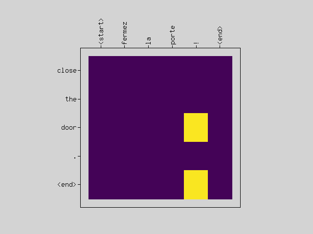
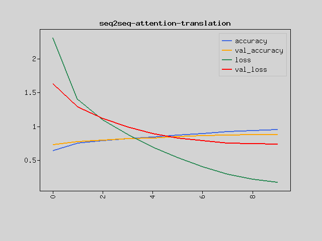
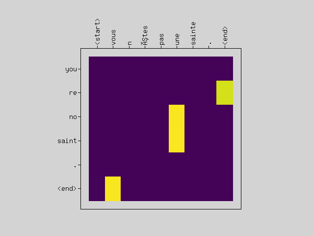

This tutorial uses a Recurrent Neural Network (RNN) and Attention on PHP to build a model for converting from French to English.

First, convert sentences into French Sequence and English Sequence using Tokenizer, which is often used when dealing with natural language.
A learning model for converting one Sequence to another is called Sequence to sequence learning.

We use Recurrent Neural Network (RNN) and Attention in this machine learning model.

In this model, Attention indicates which part of the input gets the model's attention. By building a model similar to humans, the accuracy of conversion will increase.



Advance preparation
-------------------
Set up Rindow Neural Networks to work before you start. The installation procedure is
See [Rindow Neural Networks installation](/neuralnetworks/install.md).

Experience that even PHP works fast enough for RNNs.
If you are using a Windows environment, we recommend using Rindow CLBlast / OpenCL.

For those who have already completed the [Basic image clasification on PHP](basic-image-classification.html) tutorial or have equivalent knowledge.

Data set
--------
Data in various languages is provided by http://www.manythings.org/anki/.
This data contains pairs of English sentences and sentences translated into other languages.
This tutorial uses English and French datasets.

For example, like this.
```
Let me do that.       Laissez moi faire ça.
```
Convert this data into data that can be entered into the model.

First, divide the sentence into English and French sentences, and add markers at the beginning and end of each sentence.
```
English:   <start> Let me do that. <end>
French:    <start> Laissez moi faire ça. <end>
```

Then convert this to Sequence with Tokenizer.
The following processing is performed inside Tokenizer.

+ Remove special characters from sentences.
+ Divide into words.
+ Make a word dictionary.
+ Convert words to word numbers to create Sequence

Pad the converted sequence to the maximum length, and the input sequence is complete.
The French dataset has 190,000 sentence pairs, so cut it out to the appropriate place and shuffle the order.


The code that does these things is shown below.
```php
require __DIR__.'/../vendor/autoload.php';

use Interop\Polite\Math\Matrix\NDArray;
use Rindow\NeuralNetworks\Layer\AbstractRNNLayer;
use Rindow\NeuralNetworks\Model\AbstractModel;
use Rindow\NeuralNetworks\Gradient\Variable;
use Rindow\Math\Matrix\MatrixOperator;
use Rindow\Math\Plot\Plot;
use Rindow\NeuralNetworks\Backend\RindowBlas\Backend;
use Rindow\NeuralNetworks\Builder\NeuralNetworks;
use Rindow\NeuralNetworks\Data\Sequence\Tokenizer;
use Rindow\NeuralNetworks\Data\Sequence\Preprocessor;

class EngFraDataset
{
    protected $baseUrl = 'http://www.manythings.org/anki/';
    protected $downloadFile = 'fra-eng.zip';

    public function __construct($mo,$inputTokenizer=null,$targetTokenizer=null)
    {
        $this->mo = $mo;
        $this->datasetDir = $this->getDatasetDir();
        if(!file_exists($this->datasetDir)) {
            @mkdir($this->datasetDir,0777,true);
        }
        $this->saveFile = $this->datasetDir . "/fra-eng.pkl";
        $this->preprocessor = new Preprocessor($mo);
    }

    protected function getDatasetDir()
    {
        return sys_get_temp_dir().'/rindow/nn/datasets/fra-eng';
    }

    protected function download($filename)
    {
        $filePath = $this->datasetDir . "/" . $filename;

        if(!file_exists($filePath)){
            $this->console("Downloading " . $filename . " ... ");
            copy($this->baseUrl.$filename, $filePath);
            $this->console("Done\n");
        }

        $memberfile = 'fra.txt';
        $path = $this->datasetDir.'/'.$memberfile;
        if(file_exists($path)){
            return $path;
        }
        $this->console("Extract to:".$this->datasetDir.'/..'."\n");
        $files = [$memberfile];
        $zip = new ZipArchive();
        $zip->open($filePath);
        $zip->extractTo($this->datasetDir);
        $zip->close();
        $this->console("Done\n");

        return $path;
    }

    public function preprocessSentence($w)
    {
        $w = '<start> '.$w.' <end>';
        return $w;
    }

    public function createDataset($path, $numExamples)
    {
        $contents = file_get_contents($path);
        if($contents==false) {
            throw new InvalidArgumentException('file not found: '.$path);
        }
        $lines = explode("\n",trim($contents));
        unset($contents);
        $trim = function($w) { return trim($w); };
        $enSentences = [];
        $spSentences = [];
        foreach ($lines as $line) {
            if($numExamples!==null) {
                $numExamples--;
                if($numExamples<0)
                    break;
            }
            $blocks = explode("\t",$line);
            $blocks = array_map($trim,$blocks);
            $en = $this->preprocessSentence($blocks[0]);
            $sp = $this->preprocessSentence($blocks[1]);
            $enSentences[] = $en;
            $spSentences[] = $sp;
        }
        return [$enSentences,$spSentences];
    }

    public function tokenize($lang,$numWords=null,$tokenizer=null)
    {
        if($tokenizer==null) {
            $tokenizer = new Tokenizer($this->mo,
                num_words:$numWords,
                filters:"\"\'#$%&()*+,-./:;=@[\\]^_`{|}~\t\n",
                specials:"?.!,¿",
            );
        }
        $tokenizer->fitOnTexts($lang);
        $sequences = $tokenizer->textsToSequences($lang);
        $tensor = $this->preprocessor->padSequences($sequences, padding:'post');
        return [$tensor, $tokenizer];
    }

    protected function console($message)
    {
        fwrite(STDERR,$message);
    }

    public function loadData(
        string $path=null, int $numExamples=null, int $numWords=null)
    {
        if($path==null) {
            $path = $this->download($this->downloadFile);
        }
        # creating cleaned input, output pairs
        [$targ_lang, $inp_lang] = $this->createDataset($path, $numExamples);

        [$input_tensor, $inp_lang_tokenizer] = $this->tokenize($inp_lang,$numWords);
        [$target_tensor, $targ_lang_tokenizer] = $this->tokenize($targ_lang,$numWords);
        $numInput = $input_tensor->shape()[0];
        $choice = $this->mo->random()->choice($numInput,$numInput,$replace=false);
        $input_tensor = $this->shuffle($input_tensor,$choice);
        $target_tensor = $this->shuffle($target_tensor,$choice);

        return [$input_tensor, $target_tensor, $inp_lang_tokenizer, $targ_lang_tokenizer];
    }

    public function shuffle(NDArray $tensor, NDArray $choice) : NDArray
    {
        $result = $this->mo->zerosLike($tensor);
        $size = $tensor->shape()[0];
        for($i=0;$i<$size;$i++) {
            $this->mo->la()->copy($tensor[$choice[$i]],$result[$i]);
        }
        return $result;
    }

    public function convert($lang, NDArray $tensor) : void
    {
        $size = $tensor->shape()[0];
        for($i=0;$t<$size;$t++) {
            $t = $tensor[$i];
            if($t!=0)
                echo sprintf("%d ----> %s\n", $t, $lang->index_word[$t]);
        }
    }
}
```

Let's create a dataset.

```php
$mo = new MatrixOperator();
$numExamples=20000;
$numWords=null;
$dataset = new EngFraDataset($mo);
[$inputTensor, $targetTensor, $inpLang, $targLang]
    = $dataset->loadData(null,$numExamples,$numWords);
echo "inputTensor[0]=".$mo->toString($inputTensor[0])."\n";
echo "targetTensor[0]=".$mo->toString($targetTensor[0])."\n";
echo "input=".$inpLang->sequencesToTexts($inputTensor[[0,1]])[0]."\n";
echo "target=".$targLang->sequencesToTexts($targetTensor[[0,1]])[0]."\n";

# inputTensor[0]=[1,11,19,174,218,168,3,2,0,0,0,0,0,0,0,0,0]
# targetTensor[0]=[1,15,268,140,148,3,2,0,0]
# input=<start> il a pris son livre . <end>
# target=<start> he took his book . <end>

```

Encoder / decoder model
-----------------------
For models often used in "Sequence to sequence learning"
There are encoder / decoder models.

Extract the meaning vector from the input data with the encoder
It learns to generate target data when passing through a decoder from that vector.

Here we use GRU Layer for the encoder and decoder.
GRU is one of the Recurrent Neural Networks (RNNs) and is commonly used these days.
Predict words one after another by using RNN.

It also uses an Attention Layer.
Attention has the effect of focusing on the output word that corresponds to the input word.


Encoder
------------
The input sequence is passed through the Embedding layer to query the word embedding vector.

The output of the sequence that passed them through the GRU is passed to the decoder as the Attention input.
The output of the GRU status as a result of vectorizing the input sequence
Pass it to the status input of the decoder.

```php
class Encoder extends AbstractModel
{
    public function __construct(
        $backend,
        $builder,
        int $vocabSize,
        int $wordVectSize,
        int $units,
        int $inputLength
        )
    {
        $this->backend = $backend;
        $this->vocabSize = $vocabSize;
        $this->wordVectSize = $wordVectSize;
        $this->units = $units;
        $this->embedding = $builder->layers()->Embedding(
            $vocabSize,$wordVectSize,
            input_length:$inputLength
        );
        $this->rnn = $builder->layers()->GRU(
            $units,
            return_state:true,return_sequences:true,
            recurrent_initializer:'glorot_uniform'
        );
    }

    protected function call(
        object $inputs,
        Variable|bool $training,
        array $initial_state=null,
        array $options=null
        ) : array
    {
        $K = $this->backend;
        $wordVect = $this->embedding->forward($inputs,$training);
        [$outputs,$states] = $this->rnn->forward(
            $wordVect,$training,$initial_state);
        return [$outputs, $states];
    }
}
```

Decoder
-------
The decoder is a bit complicated.
Given a status input, the corresponding sequence must be generated.
When <start> is given, the next word is generated, and when the generated word is given, the Decoder is trained to generate the next word.
Instead of inputting the words that should be output as shown in the figure, the efficiency is improved by giving a sequence of correct words from the beginning to learn.
Note that the input and output are off by one word.

Also use Attention.
A specific word on an input sequence is trained to react to a word on a specific output sequence.
Makes the output more responsive when certain words appear.
The depth of relevance between the input word and the output word is calculated inside Attention as the Attention Weight.
You can take this out and visualize it.


```php
class Decoder extends AbstractModel
{
    protected $backend;
    protected $vocabSize;
    protected $wordVectSize;
    protected $units;
    protected $targetLength;
    protected $embedding;
    protected $rnn;
    protected $attention;
    protected $concat;
    protected $dense;
    protected $attentionScores;

    public function __construct(
        $backend,
        $builder,
        int $vocabSize,
        int $wordVectSize,
        int $units,
        int $inputLength,
        int $targetLength
        )
    {
        $this->backend = $backend;
        $this->vocabSize = $vocabSize;
        $this->wordVectSize = $wordVectSize;
        $this->units = $units;
        $this->inputLength = $inputLength;
        $this->targetLength = $targetLength;
        $this->embedding = $builder->layers()->Embedding(
            $vocabSize, $wordVectSize,
            input_length:$targetLength
        );
        $this->rnn = $builder->layers()->GRU($units,
            return_state:true,return_sequences:true,
            recurrent_initializer:'glorot_uniform'
        );
        $this->attention = $builder->layers()->Attention();
        $this->concat = $builder->layers()->Concatenate();
        $this->dense = $builder->layers()->Dense($vocabSize);
    }

    protected function call(
        object $inputs,
        Variable|bool $training,
        array $initial_state=null,
        array $options=null
        ) : array
    {
        $K = $this->backend;
        $encOutputs=$options['enc_outputs'];

        $x = $this->embedding->forward($inputs,$training);
        [$rnnSequence,$states] = $this->rnn->forward(
            $x,$training,$initial_state);

        $contextVector = $this->attention->forward(
            [$rnnSequence,$encOutputs],$training,$options);
        if(is_array($contextVector)) {
            [$contextVector,$attentionScores] = $contextVector;
            $this->attentionScores = $attentionScores;
        }
        $outputs = $this->concat->forward([$contextVector, $rnnSequence],$training);

        $outputs = $this->dense->forward($outputs,$training);
        return [$outputs,$states];
    }

    public function getAttentionScores()
    {
        return $this->attentionScores;
    }
}
```

Loss function and Seq2Seq model
--------------------------------
Let's create the desired model by combining the Decoder and Encoder that we have created so far.

The Loss function uses Sparse Categorical Crossentropy.
However, remember that when comparing the output sequences, they are off by one word.
Let's stagger the sequence to compare using a special method of the custom model.

In addition, add a method that lets the trained model perform the translation.
Instead of giving the entire correct output sequence during training, you just have to infer word by word from <start>.
It also visualizes Attention Weight.

```php
class Seq2seq extends AbstractModel
{
    public function __construct(
        $mo,
        $backend,
        $builder,
        $inputLength=null,
        $inputVocabSize=null,
        $outputLength=null,
        $targetVocabSize=null,
        $wordVectSize=8,
        $units=256,
        $startVocId=0,
        $endVocId=0,
        $plt=null
        )
    {
        parent::__construct($backend,$builder);
        $this->encoder = new Encoder(
            $backend,
            $builder,
            $inputVocabSize,
            $wordVectSize,
            $units,
            $inputLength
        );
        $this->decoder = new Decoder(
            $backend,
            $builder,
            $targetVocabSize,
            $wordVectSize,
            $units,
            $inputLength,
            $outputLength
        );
        $this->out = $builder->layers()->Activation('softmax');
        $this->mo = $mo;
        $this->backend = $backend;
        $this->startVocId = $startVocId;
        $this->endVocId = $endVocId;
        $this->inputLength = $inputLength;
        $this->outputLength = $outputLength;
        $this->units = $units;
        $this->plt = $plt;
    }

    protected function call($inputs, $training, $trues)
    {
        $K = $this->backend;
        [$encOutputs,$states] = $this->encoder->forward($inputs,$training);
        $options = ['enc_outputs'=>$encOutputs];
        [$outputs,$dmyStatus] = $this->decoder->forward($trues,$training,$states,$options);
        $outputs = $this->out->forward($outputs,$training);
        return $outputs;
    }

    public function shiftLeftSentence(
        NDArray $sentence
        ) : NDArray
    {
        $K = $this->backend;
        $shape = $sentence->shape();
        $batchs = $shape[0];
        $zeroPad = $K->zeros([$batchs,1],$sentence->dtype());
        $seq = $K->slice($sentence,[0,1],[-1,-1]);
        $result = $K->concat([$seq,$zeroPad],$axis=1);
        return $result;
    }

    protected function trueValuesFilter(NDArray $trues) : NDArray
    {
        return $this->shiftLeftSentence($trues);
    }

    public function predict($inputs, ...$options) : NDArray
    {
        $K = $this->backend;
        $attentionPlot = $options['attention_plot'];
        $inputs = $K->array($inputs);

        if($inputs->ndim()!=2) {
            throw new InvalidArgumentException('inputs shape must be 2D.');
        }
        $batchs = $inputs->shape()[0];
        if($batchs!=1) {
            throw new InvalidArgumentException('num of batch must be one.');
        }
        $status = [$K->zeros([$batchs, $this->units])];
        [$encOutputs, $status] = $this->encoder->forward($inputs, $training=false, $status);

        $decInputs = $K->array([[$this->startVocId]],$inputs->dtype());

        $result = [];
        $this->setShapeInspection(false);
        for($t=0;$t<$this->outputLength;$t++) {
            [$predictions, $status] = $this->decoder->forward(
                $decInputs, $training=false, $status,
                ['enc_outputs'=>$encOutputs,'return_attention_scores'=>true]);

            # storing the attention weights to plot later on
            $scores = $this->decoder->getAttentionScores();
            $this->mo->la()->copy(
                $K->ndarray($scores->reshape([$this->inputLength])),
                $attentionPlot[$t]);

            $predictedId = $K->scalar($K->argmax($predictions[0][0]));

            $result[] = $predictedId;

            if($this->endVocId == $predictedId) {
                $t++;
                break;
            }

            # the predicted ID is fed back into the model
            $decInputs = $K->array([[$predictedId]],$inputs->dtype());
        }

        $this->setShapeInspection(true);
        $result = $K->array([$result],NDArray::int32);
        return $K->ndarray($result);
    }

    public function plotAttention(
        $attention, $sentence, $predictedSentence)
    {
        $plt = $this->plt;
        $config = [
            'frame.xTickPosition'=>'up',
            'frame.xTickLabelAngle'=>90,
            'figure.topMargin'=>100,
        ];
        $plt->figure(null,null,$config);
        $sentenceLen = count($sentence);
        $predictLen = count($predictedSentence);
        $image = $this->mo->zeros([$predictLen,$sentenceLen],$attention->dtype());
        for($y=0;$y<$predictLen;$y++) {
            for($x=0;$x<$sentenceLen;$x++) {
                $image[$y][$x] = $attention[$y][$x];
            }
        }
        $plt->imshow($image, $cmap='viridis',null,null,$origin='upper');

        $plt->xticks($this->mo->arange(count($sentence)),$sentence);
        $predictedSentence = array_reverse($predictedSentence);
        $plt->yticks($this->mo->arange(count($predictedSentence)),$predictedSentence);
    }
}
```

Training
--------
Now that the model class is complete, give it some data and train.

Select the parameters according to the scale that can be tested according to the machine.
The main conditions are as follows.

```php
$numExamples=20000;#30000
$numWords=null;
$epochs = 10;
$batchSize = 64;
$wordVectSize=256;
$units=1024;
```

Let's create sequence data first.

```php
$mo = new MatrixOperator();
$nn = new NeuralNetworks($mo);
$pltConfig = [];
$plt = new Plot($pltConfig,$mo);

$dataset = new EngFraDataset($mo);

echo "Generating data...\n";
[$inputTensor, $targetTensor, $inpLang, $targLang]
    = $dataset->loadData(null,$numExamples,$numWords);
$valSize = intval(floor(count($inputTensor)/10));
$trainSize = count($inputTensor)-$valSize;
$inputTensorTrain  = $inputTensor[[0,$trainSize-1]];
$targetTensorTrain = $targetTensor[[0,$trainSize-1]];
$inputTensorVal  = $inputTensor[[$trainSize,$valSize+$trainSize-1]];
$targetTensorVal = $targetTensor[[$trainSize,$valSize+$trainSize-1]];

$inputLength  = $inputTensor->shape()[1];
$outputLength = $targetTensor->shape()[1];
$inputVocabSize = $inpLang->numWords();
$targetVocabSize = $targLang->numWords();
$corpusSize = count($inputTensor);

echo "num_examples: $numExamples\n";
echo "num_words: $numWords\n";
echo "epoch: $epochs\n";
echo "batchSize: $batchSize\n";
echo "embedding_dim: $wordVectSize\n";
echo "units: $units\n";
echo "Total questions: $corpusSize\n";
echo "Input  word dictionary: $inputVocabSize(".$inpLang->numWords(true).")\n";
echo "Target word dictionary: $targetVocabSize(".$targLang->numWords(true).")\n";
echo "Input length: $inputLength\n";
echo "Output length: $outputLength\n";

# Generating data...
# num_examples: 20000
# num_words:
# epoch: 10
# batchSize: 64
# embedding_dim: 256
# units: 1024
# Total questions: 20000
# Input  word dictionary: 6828(6828)
# Target word dictionary: 3389(3389)
# Input length: 17
# Output length: 9
```

Instantiate and compile the model.

```php
$seq2seq = new Seq2seq(
    $mo,
    $nn->backend(),
    $nn,
    $inputLength,
    $inputVocabSize,
    $outputLength,
    $targetVocabSize,
    $wordVectSize,
    $units,
    $targLang->wordToIndex('<start>'),
    $targLang->wordToIndex('<end>'),
    $plt
);

echo "Compile model...\n";
$seq2seq->compile(
    loss:'sparse_categorical_crossentropy',
    optimizer:'adam',
    metrics:['accuracy','loss'],
);
$seq2seq->build([1,$inputLength], true, [1,$outputLength]); // just for summary
$seq2seq->summary();

# Compile model...
# Layer(type)                  Output Shape               Param #
# ==================================================================
# Embedding(Embedding)         (17,256)                   1747968
# GRU(GRU)                     (17,1024)                  3938304
# Embedding_1(Embedding)       (9,256)                    867584
# GRU_1(GRU)                   (9,1024)                   3938304
# Attention(Attention)         (9,1024)                   0
# Concatenate(Concatenate)     (9,2048)                   0
# Dense(Dense)                 (9,3389)                   6944061
# Activation(Activation)       (9,3389)                   0
# ==================================================================
# Total params: 17436221
```

Train the Seq2Seq model.

```php
$modelFilePath = __DIR__."/neural-machine-translation-with-attention.model";

if(file_exists($modelFilePath)) {
    echo "Loading model...\n";
    $seq2seq->loadWeightsFromFile($modelFilePath);
} else {
    echo "Train model...\n";
    $history = $seq2seq->fit(
        $inputTensorTrain,
        $targetTensorTrain,
            batch_size:$batchSize,
            epochs:$epochs,
            validation_data:[$inputTensorVal,$targetTensorVal],
            #callbacks:[checkpoint],
        );
    $seq2seq->saveWeightsToFile($modelFilePath);

    $plt->figure();
    $plt->plot($mo->array($history['accuracy']),null,null,'accuracy');
    $plt->plot($mo->array($history['val_accuracy']),null,null,'val_accuracy');
    $plt->plot($mo->array($history['loss']),null,null,'loss');
    $plt->plot($mo->array($history['val_loss']),null,null,'val_loss');
    $plt->legend();
    $plt->title('seq2seq-attention-translation');
}
# Train model...
# Train on 18000 samples, validation on 2000 samples
# Epoch 1/10 [.........................] 3319 sec. remaining:00:00  - 3448 sec.
#  loss:2.3151 accuracy:0.6364 val_loss:1.6268 val_accuracy:0.7265
# Epoch 2/10 [.........................] 3298 sec. remaining:00:00  - 3425 sec.
#  loss:1.4021 accuracy:0.7504 val_loss:1.2861 val_accuracy:0.7754
# Epoch 3/10 [.........................] 3291 sec. remaining:00:00  - 3420 sec.
#  loss:1.0953 accuracy:0.7883 val_loss:1.1134 val_accuracy:0.7985
# Epoch 4/10 [.........................] 3141 sec. remaining:00:00  - 3267 sec.
#  loss:0.8774 accuracy:0.8157 val_loss:0.9888 val_accuracy:0.8165
# Epoch 5/10 [.........................] 3300 sec. remaining:00:00  - 3428 sec.
#  loss:0.6936 accuracy:0.8417 val_loss:0.8959 val_accuracy:0.8287
# Epoch 6/10 [.........................] 3300 sec. remaining:00:00  - 3427 sec.
#  loss:0.5343 accuracy:0.8693 val_loss:0.8264 val_accuracy:0.8472
# Epoch 7/10 [.........................] 3293 sec. remaining:00:00  - 3420 sec.
#  loss:0.3985 accuracy:0.8960 val_loss:0.7860 val_accuracy:0.8595
# Epoch 8/10 [.........................] 3298 sec. remaining:00:00  - 3425 sec.
#  loss:0.2893 accuracy:0.9202 val_loss:0.7500 val_accuracy:0.8672
# Epoch 9/10 [.........................] 3297 sec. remaining:00:00  - 3424 sec.
#  loss:0.2175 accuracy:0.9386 val_loss:0.7444 val_accuracy:0.8767
# Epoch 10/10 [.........................] 3296 sec. remaining:00:00  - 3423 sec.
#  loss:0.1702 accuracy:0.9519 val_loss:0.7359 val_accuracy:0.8811
```



Predict
------
Let's do machine translation with the learned model.

Also, visualize the attention-scores when translating to see if the input word responds to a particular output word.

```php
$choice = $mo->random()->choice($corpusSize,10,false);
foreach($choice as $idx)
{
    $question = $inputTensor[$idx]->reshape([1,$inputLength]);
    $attentionPlot = $mo->zeros([$outputLength, $inputLength]);
    $predict = $seq2seq->predict(
        $question,attention_plot:$attentionPlot);
    $answer = $targetTensor[$idx]->reshape([1,$outputLength]);;
    $sentence = $inpLang->sequencesToTexts($question)[0];
    $predictedSentence = $targLang->sequencesToTexts($predict)[0];
    $targetSentence = $targLang->sequencesToTexts($answer)[0];
    echo "Input:   $sentence\n";
    echo "Predict: $predictedSentence\n";
    echo "Target:  $targetSentence\n";
    echo "\n";
    $q = [];
    foreach($question[0] as $n) {
        if($n==0)
            break;
        $q[] = $inpLang->indexToWord($n);
    }
    $p = [];
    foreach($predict[0] as $n) {
        if($n==0)
            break;
        $p[] = $targLang->indexToWord($n);
    }
    $seq2seq->plotAttention($attentionPlot,  $q, $p);
}
$plt->show();

# Input:   <start> j ai besoin de soutien . <end>
# Predict: i need support . <end>
# Target:  <start> i need support . <end>
#
# Input:   <start> est ce sérieux  ? <end>
# Predict: no kidding ? <end>
# Target:  <start> is it serious ? <end>
#
# Input:   <start> magnifique  ! <end>
# Predict: wonderful ! <end>
# Target:  <start> terrific ! <end>
#
# Input:   <start> je m aime . <end>
# Predict: i like myself . <end>
# Target:  <start> i love myself . <end>
#
# Input:   <start> vous n êtes pas une sainte . <end>
# Predict: you re no saint . <end>
# Target:  <start> you re no saint . <end>
#
# Input:   <start> mille mercis . <end>
# Predict: many thanks . <end>
# Target:  <start> many thanks . <end>
#
# Input:   <start> il est poète . <end>
# Predict: he is a poet . <end>
# Target:  <start> he is a poet . <end>
#
# Input:   <start> fermez la porte ! <end>
# Predict: close the door . <end>
# Target:  <start> close the door . <end>
#
# Input:   <start> que peut on y faire ? <end>
# Predict: what do we do ? <end>
# Target:  <start> what can you do ? <end>
#
# Input:   <start> est ce vous ? <end>
# Predict: is it you ? <end>
# Target:  <start> is that you ? <end>
```



For a model as simple as an experiment, you can see that it is often translated well.

It seems that the attention-scores image may or may not be well visualized.
