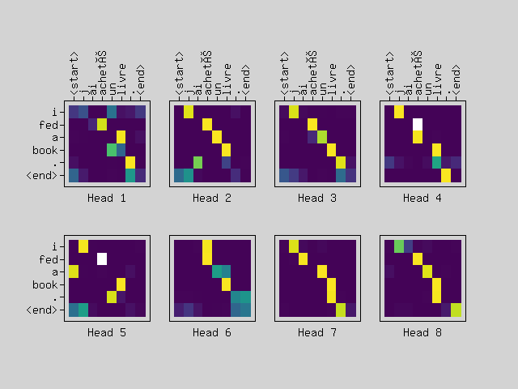
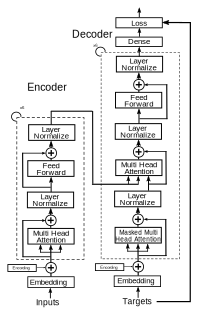
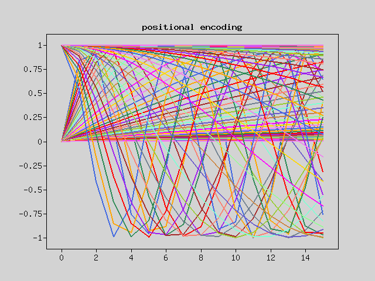
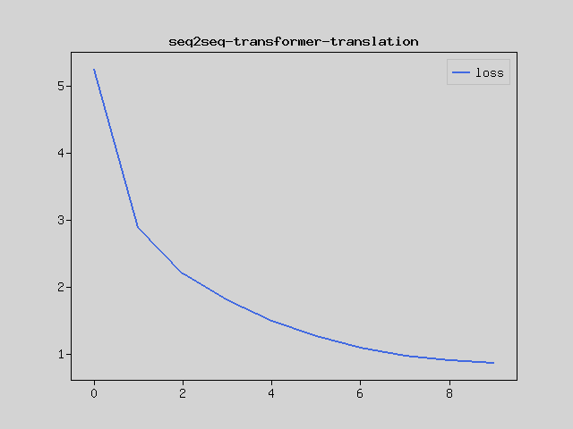

In this tutorial, we'll build a translation model from French to English using a Transformer model in PHP.

What is a Transformer Model
---------------------------

A Transformer is a translation model that uses an attention mechanism.
It's a very powerful model that can be applied to various tasks, not just natural language processing.
It doesn't use RNN blocks but rather uses only attention, which improves parallel computation efficiency and enables faster learning and inference.



Prerequisites
------------
Before starting, please set up Rindow Neural Networks. For installation instructions, refer to
[Installing Rindow Neural Networks](/neuralnetworks/install.html).

Experience how Transformers can run efficiently even in PHP.
If you're using a Windows environment, we recommend using Rindow CLBlast / OpenCL.

This tutorial is for those who have completed the [Basic Image Classification in PHP](basic-image-classification.html) tutorial or have equivalent knowledge.

Dataset
-------
We'll use data for various languages provided by http://www.manythings.org/anki/.
This data contains pairs of English sentences and their translations in other languages.
In this tutorial, we'll use the English and French dataset.

For example:
```
Let me do that.       Laissez moi faire ça.
```
We'll convert this data into a format that can be input to our model.

First, we split the data into English and French sentences and add markers to the beginning and end of each sentence.

```
English:   <start> Let me do that. <end>
French:    <start> Laissez moi faire ça. <end>
```

Next, we convert these sentences into sequences using a tokenizer.
The tokenizer performs the following processes:

+ Removes special characters from the sentences.
+ Splits them into words.
+ Creates a word dictionary.
+ Converts words into word numbers to create sequences.

The input sequence is completed by padding the converted sequences to the maximum length.
Since the French dataset has 190,000 sentence pairs, we'll cut it at an appropriate point and shuffle the order.

Here's the code that does these things:
```php
use Interop\Polite\Math\Matrix\NDArray;
use Rindow\NeuralNetworks\Layer\Layer;
use Rindow\NeuralNetworks\Model\AbstractModel;
use Rindow\NeuralNetworks\Model\Model;
use Rindow\NeuralNetworks\Gradient\Variable;
use Rindow\NeuralNetworks\Gradient\Module;
use Rindow\Math\Matrix\MatrixOperator;
use Rindow\Math\Plot\Plot;
use Rindow\NeuralNetworks\Backend\RindowBlas\Backend;
use Rindow\NeuralNetworks\Builder\NeuralNetworks;
use Rindow\NeuralNetworks\Data\Sequence\Tokenizer;
use Rindow\NeuralNetworks\Data\Sequence\Preprocessor;
use Rindow\NeuralNetworks\Optimizer\Schedule\LearningRateSchedule;
use function Rindow\Math\Matrix\R;

# Download the file
class EngFraDataset
{
    protected $baseUrl = 'http://www.manythings.org/anki/';
    protected $downloadFile = 'fra-eng.zip';
    protected $mo;
    protected $datasetDir;
    protected $saveFile;
    protected $preprocessor;

    public function __construct($mo,$inputTokenizer=null,$targetTokenizer=null)
    {
        $this->mo = $mo;
        $this->datasetDir = $this->getDatasetDir();
        if(!file_exists($this->datasetDir)) {
            @mkdir($this->datasetDir,0777,true);
        }
        $this->saveFile = $this->datasetDir . "/fra-eng.pkl";
        $this->preprocessor = new Preprocessor($mo);
    }

    protected function getRindowDatesetDir() : string
    {
        $dataDir = getenv('RINDOW_NEURALNETWORKS_DATASETS');
        if(!$dataDir) {
            $dataDir = sys_get_temp_dir().'/rindow/nn/datasets';
        }
        return $dataDir;
    }

    protected function getDatasetDir() : string
    {
        return $this->getRindowDatesetDir().'/fra-eng';
    }


    protected function download($filename)
    {
        $filePath = $this->datasetDir . "/" . $filename;

        if(!file_exists($filePath)){
            $this->console("Downloading " . $filename . " ... ");
            copy($this->baseUrl.$filename, $filePath);
            $this->console("Done\n");
        }

        $memberfile = 'fra.txt';
        $path = $this->datasetDir.'/'.$memberfile;
        if(file_exists($path)){
            return $path;
        }
        $this->console("Extract to:".$this->datasetDir.'/..'."\n");
        $files = [$memberfile];
        if(!class_exists("ZipArchive")) {
            throw new RuntimeException("Please configure the zip php-extension.");
        }
        $zip = new ZipArchive();
        $zip->open($filePath);
        $zip->extractTo($this->datasetDir);
        $zip->close();
        $this->console("Done\n");

        return $path;
    }

    public function preprocessSentence($w)
    {
        $w = '<start> '.$w.' <end>';
        return $w;
    }

    public function createDataset($path, $numExamples)
    {
        $contents = file_get_contents($path);
        if($contents==false) {
            throw new InvalidArgumentException('file not found: '.$path);
        }
        $lines = explode("\n",trim($contents));
        unset($contents);
        $trim = function($w) { return trim($w); };
        $enSentences = [];
        $spSentences = [];
        foreach ($lines as $line) {
            if($numExamples!==null) {
                $numExamples--;
                if($numExamples<0)
                    break;
            }
            $blocks = explode("\t",$line);
            $blocks = array_map($trim,$blocks);
            $en = $this->preprocessSentence($blocks[0]);
            $sp = $this->preprocessSentence($blocks[1]);
            $enSentences[] = $en;
            $spSentences[] = $sp;
        }
        return [$enSentences,$spSentences];
    }

    public function tokenize($lang,$numWords=null,$tokenizer=null)
    {
        if($tokenizer==null) {
            $tokenizer = new Tokenizer($this->mo,
                num_words: $numWords,
                filters: "\"\'#$%&()*+,-./:;=@[\\]^_`{|}~\t\n",
                specials: "?.!,¿",
            );
        }
        $tokenizer->fitOnTexts($lang);
        $sequences = $tokenizer->textsToSequences($lang);
        $tensor = $this->preprocessor->padSequences($sequences,padding:'post');
        return [$tensor, $tokenizer];
    }

    protected function console($message)
    {
        fwrite(STDERR,$message);
    }

    public function loadData(
        ?string $path=null, ?int $numExamples=null, ?int $numWords=null)
    {
        if($path==null) {
            $path = $this->download($this->downloadFile);
        }
        # creating cleaned input, output pairs
        [$targ_lang, $inp_lang] = $this->createDataset($path, $numExamples);

        [$input_tensor, $inp_lang_tokenizer] = $this->tokenize($inp_lang,$numWords);
        [$target_tensor, $targ_lang_tokenizer] = $this->tokenize($targ_lang,$numWords);
        $numInput = $input_tensor->shape()[0];
        $choice = $this->mo->random()->choice($numInput,$numInput,$replace=false);
        $input_tensor = $this->shuffle($input_tensor,$choice);
        $target_tensor = $this->shuffle($target_tensor,$choice);

        return [$input_tensor, $target_tensor, $inp_lang_tokenizer, $targ_lang_tokenizer];
    }

    public function shuffle(NDArray $tensor, NDArray $choice) : NDArray
    {
        $result = $this->mo->zerosLike($tensor);
        $size = $tensor->shape()[0];
        for($i=0;$i<$size;$i++) {
            $this->mo->la()->copy($tensor[$choice[$i]],$result[$i]);
        }
        return $result;
    }

    public function convert($lang, NDArray $tensor) : void
    {
        $size = $tensor->shape()[0];
        for($i=0;$t<$size;$t++) {
            $t = $tensor[$i];
            if($t!=0)
                echo sprintf("%d ----> %s\n", $t, $lang->index_word[$t]);
        }
    }
}
```

Let's create the dataset:
```php
$mo = new MatrixOperator();
$dataset = new EngFraDataset($mo);

echo "Generating data...\n";
[$inputTensor, $targetTensor, $inpLang, $targLang]
    = $dataset->loadData(null,$numExamples,$numWords);
$valSize = intval(floor(count($inputTensor)/100));
$trainSize = count($inputTensor)-$valSize;
//$inputTensorTrain  = $inputTensor[R(0,$trainSize)];
//$targetTensorTrain = $targetTensor[R(0,$trainSize)];
//$inputTensorVal  = $inputTensor[R($trainSize,$valSize+$trainSize)];
//$targetTensorVal = $targetTensor[R($trainSize,$valSize+$trainSize)];
$inputTensorTrain  = $inputTensor[R(0,$trainSize)];
$targetTensorTrain = $targetTensor[R(0,$trainSize)];
$inputTensorVal  = $inputTensor[R($trainSize,$valSize+$trainSize)];
$targetTensorVal = $targetTensor[R($trainSize,$valSize+$trainSize)];

$labelTensorTrain = make_labels($mo->la(),$targetTensorTrain);
$labelTensorVal = make_labels($mo->la(),$targetTensorVal);
```

Transformer Model Structure
--------------------------
The Transformer model is an encoder-decoder model consisting of an encoder and a decoder.

The encoder processes the input French sentences and extracts their meaning.
The decoder generates English sentences from the meaning received from the encoder.
Both the encoder and decoder have a structure that repeats similar blocks 6 times internally.
In the tutorial code, you can specify the number of repetitions.

### Block Structure
Each block consists of Multi-Head Attention, Feed Forward Network, and Add & Layer Normalization.

- **Multi-Head Attention**: A mechanism that determines and processes which information to focus on within the input information.
- **Feed Forward Network**: A standard neural network that is applied to each sequence.
- **Residual Connection (addition processing) and Layer Normalization**: Stabilizes and accelerates learning.



### Positional Embedding
The input is a French sentence, with words converted to vectors.
The output is an English sentence, with the probability of generating each word.
The input and output teacher data undergo word-to-vector conversion (Embedding) and positional information addition (Positional Encoding).
This sample uses sine wave-based positional encoding.

```php
class PositionalEmbedding extends AbstractModel
{
    protected int $d_model;
    protected object $gradient;
    protected Layer $embedding;
    protected Layer $inheritMask;
    protected Variable $posEncoding;

    public function __construct(
        object $builder,
        int $vocab_size,
        int $d_model,
        ?int $maximumPositionEncoding=null,
        ?int $inputLength=null,
        ?string $name=null,
        )
    {
        parent::__construct($builder,name:$name);
        $this->d_model = $d_model;
        $maximumPositionEncoding ??= 256;
        $this->gradient = $builder->gradient();
        $nn = $builder;
        $g = $this->gradient;

        $this->embedding = $nn->layers->Embedding(
            $vocab_size,    // inputDim
            $d_model,       // outputDim
            mask_zero:true,
            input_length:$inputLength,
            name:"embedding.{$name}",
        );
        $this->inheritMask = $nn->layers->InheritMask(name:"mask.{$name}");

        $this->posEncoding = $g->Variable(
            $this->positionalEncoding(maxLength:$maximumPositionEncoding, depth:$d_model),
            trainable:false,
            unbackpropagatable:true,
            name:'posEncoding',
        );
    }

    public function positionalEncoding(int $maxLength, int $depth) : NDArray
    {
        $K = $this->backend;
        if($depth%2 != 0) {
            throw new InvalidArgumentException("depth must be a multiple of 2");
        }
        $depth = $depth/2;

        $positions = $K->repeat(                                # (maxLength, depth/2)
            $K->range($maxLength),$depth,axis:1);
        $depths = $K->scale(1/$depth,$K->range($depth));        # (depth/2)
        $angleRates = $K->reciprocal($this->pow(10000,$depths));# (depth/2)
        $angleRads = $K->mul($positions,$angleRates);           # (maxLength, depth/2)
      
        $posEncoding = $K->concat(                              # (maxLength, depth/2*2)
            [$K->sin($angleRads), $K->cos($angleRads)],
            $axis=-1); 
      
        return $posEncoding;                                    # (maxLength, depth)
    }

    protected function pow(NDArray|float $x, NDArray $y)
    {
        $K = $this->backend;
        if(is_numeric($x)) {
            $x = $K->fill($y->shape(),$x,dtype:$y->dtype());
        }
        return $K->pow($x,$y);
    }

    public function call(NDArray $inputs)
    {
        $g = $this->gradient;
        // Embedding
        $input_vect = $this->embedding->forward($inputs);

        // positional Encoding
        $inputShape = $g->shape($inputs);
        $length = $g->get($inputShape,1);
        $x = $g->scale(sqrt($this->d_model), $input_vect);
        $pos_encoding = $g->get($this->posEncoding,0,$length);
        $x = $g->add($x, $pos_encoding); // broadcast add
        $x = $this->inheritMask->forward([$x,$input_vect]);
        return $x;
    }

    public function computeMask(...$args)
    {
        return $this->embedding->computeMask(...$args);
    }

}
```

Let's see how positional information is encoded.
You can see that different values are added for each position.

```php
$plt = new Plot(null,$mo);

$numWords = 1000;
$maxLength = 16;
$depth = 16;
$embedding = new PositionalEmbedding(
    $nn,
    vocab_size:$numWords,
    d_model:$depth,
);
$positionalEncoding = $embedding->positionalEncoding($maxLength, $depth);
$positionalEncoding = $K->ndarray($positionalEncoding);
$plt->figure();
$plt->plot($positionalEncoding);
$plt->title('positional encoding');
$plt->show();
```




### Residual Connection and Layer Normalization

Residual Connection is a technique introduced to mitigate the vanishing gradient problem in deep neural networks and stabilize learning. Residual Connection is achieved by adding the original input to the output of each sublayer.
Layer Normalization can stabilize learning without depending on batch size.

### Multi-Head Attention
Multi-Head Attention is a mechanism that compares input information from various angles and controls where to focus.

It can focus on any information regardless of distance, making it applicable to various tasks.
The core of Multi-Head Attention, Scaled Dot-Product Attention, calculates the dot product of queries and keys, and weights values based on similarity.
If a query and a key are similar, the corresponding value is strongly reflected.
As the name "Multi-Head" suggests, it calculates attention multiple times in multiple different ways on the input, and combines the results, enabling comparison of information from various angles.

Rindow Neural Networks provides Multi-Head Attention as a single layer.
This makes it easy to use the powerful capabilities of Multi-Head Attention.

```php
abstract class AbstractBaseAttention extends AbstractModel
{
    protected Layer $mha;
    protected Layer $layernorm;
    protected Layer $add;
    
    public function __construct(
        object $nn,
        ?string $name=null,
        ...$args
        )
    {
        parent::__construct($nn,name:$name);
        $this->mha = $nn->layers->MultiHeadAttention(...$args,
            name:"mha.{$name}",
        );
        $this->layernorm = $nn->layers->LayerNormalization(
            name:"layernorm.{$name}"
        );
        $this->add = $nn->layers->Add(name:"add.{$name}");
    }
}

class CrossAttention extends AbstractBaseAttention
{
    public ?NDArray $last_attn_scores=null;

    protected function call(NDArray $x, NDArray $context, Variable|bool|null $training=null)
    {
        [$attn_output, $attn_scores] = $this->mha->forward(
            [
                $x, // query
                $context, // value
                $context, // key
            ],
            training:$training,
            returnAttentionScores:True
        );
    
        # Cache the attention scores for plotting later.
        $this->last_attn_scores = $this->builder->gradient()->ndarray($attn_scores);
    
        $x = $this->add->forward([$x, $attn_output]);
        $x = $this->layernorm->forward($x);
        return $x;
    }
}

class GlobalSelfAttention extends AbstractBaseAttention
{
    protected function call(NDArray $x, Variable|bool|null $training=null)
    {
        $attn_output = $this->mha->forward(
            [
                $x,  // query=
                $x,  // value=
                $x   // key=
            ],
            training:$training,
        );
        $x = $this->add->forward([$x, $attn_output]);
        $x = $this->layernorm->forward($x);
        return $x;
    }
}

class CausalSelfAttention  extends AbstractBaseAttention
{
    protected function call(NDArray $x, Variable|bool|null $training=null)
    {
        $attn_output = $this->mha->forward(
            [
                $x, // query
                $x, // value
                $x, // key                
            ],
            training:$training,
            useCausalMask:True,
        );
        $x = $this->add->forward([$x, $attn_output]);
        $x = $this->layernorm->forward($x);
        return $x;
    }
}
```

### Feed Forward Network

After Multi-Head Attention, a feed-forward network is placed. This network applies non-linear transformations to each word's embedding vector, enhancing the model's expressiveness.

```php
class FeedForward extends AbstractModel
{
    protected Model $seq;
    protected Layer $add;
    protected Layer $layer_norm;

    public function __construct(
        object $nn,
        int $d_model,
        int $dff,
        float $dropout_rate=0.1,
        ?string $name=null,
    ) {
        parent::__construct($nn,name:$name);
        $this->seq = $nn->models->Sequential([
            $nn->layers->Dense($dff,
                activation:'relu',
                name:"ff1.{$name}",
            ),
            $nn->layers->Dense($d_model,
                name:"ff2.{$name}",
            ),
            $nn->layers->Dropout($dropout_rate,
                name:"dropout.{$name}",
            ),
        ]);
        $this->add = $nn->layers->Add(name:"add.{$name}");
        $this->layer_norm = $nn->layers->LayerNormalization(
            name:"layernorm.{$name}",
        );
    }

    protected function call(NDArray $x, Variable|bool|null $training=null)
    {
        $x = $this->add->forward([$x, $this->seq->forward($x,training:$training)]);
        $x = $this->layer_norm->forward($x);
        return $x;
    }

}
```

### Encoder Block
The encoder processes the input French sentences and extracts their meaning.

```php
class EncoderLayer extends AbstractModel
{
    protected Model $self_attention;
    protected Model $ffn;

    public function __construct(
        object $nn,
        int $d_model,
        int $num_heads,
        int $dff,
        float $dropout_rate=0.1,
        ?string $name=null,
    ) {
        parent::__construct($nn,name:$name);
        $this->self_attention = new GlobalSelfAttention(
            $nn,
            num_heads:$num_heads,
            key_dim:$d_model,
            dropout:$dropout_rate,
            name:"globalattn.{$name}",
    );
        $this->ffn = new FeedForward($nn, $d_model, $dff, 
            name:"ffn.{$name}",
    );
    }

    protected function call(NDArray $x, Variable|bool|null $training=null)
    {
        $x = $this->self_attention->forward($x,training:$training);
        $x = $this->ffn->forward($x,training:$training);
        return $x;
    }
}

class Encoder extends AbstractModel
{
    protected int $d_model;
    protected int $num_layers;
    protected Model $pos_embedding;
    protected Module $enc_layers;
    protected Layer $dropout;

    public function __construct(
        object $nn,
        int $num_layers,
        int $d_model,
        int $num_heads,
        int $dff,
        int $vocab_size,
        float $dropout_rate=0.1,
        ?string $name=null,
    ) {
        parent::__construct($nn,name:$name);
        $this->d_model = $d_model;
        $this->num_layers = $num_layers;
    
        $this->pos_embedding = new PositionalEmbedding(
            $nn,
            vocab_size:$vocab_size,
            d_model:$d_model,
            name:"posemb.{$name}",
        );
    
        $this->enc_layers = $nn->gradient->modules();
        for($i=0;$i<$num_layers;$i++) {
            $this->enc_layers->add(new EncoderLayer(
                $nn,
                d_model:$d_model,
                num_heads:$num_heads,
                dff:$dff,
                dropout_rate:$dropout_rate,
                name:"enc_layer$i.{$name}",
            ));
        }
        $this->dropout = $nn->layers->Dropout($dropout_rate,name:"dropout.{$name}");
    }

    protected function call(NDArray $x, Variable|bool|null $training=null)
    {
        # `x` is token-IDs shape: (batch, seq_len)
        $x = $this->pos_embedding->forward($x);  # Shape `(batch_size, seq_len, d_model)`.
        # Add dropout.
        $x = $this->dropout->forward($x, training:$training);

        foreach($this->enc_layers as $enc_layer) {
            $x = $enc_layer->forward($x, training:$training);
        }

        return $x;  # Shape `(batch_size, seq_len, d_model)`.
    }
}
```

### Decoder Block
The decoder generates English sentences from the meaning received from the encoder.

The decoder block uses Masked Multi-Head Attention, known as Causal Self-Attention.
Unlike normal self-attention, Causal Self-Attention is restricted to reference only information from past positions in the input sequence. In other words, a word at a certain position cannot see information from words at later positions.
This restriction is particularly important in text generation tasks. In text generation, the next word needs to be generated based on previously generated words, and if it sees future information, the generated text would become unnatural. Causal Self-Attention prevents such future information leakage, enabling natural text generation.

By using this for the output teacher data (English sentences in this case), it becomes possible to predict subsequent words one after another, being influenced only by the preceding words.

Also, in cross-attention, encoder outputs are used for keys and values, and decoder inputs are used for queries.
For each position in the output teacher data, information with high relevance to the input is output.

```php
class DecoderLayer extends AbstractModel
{
    protected Model $causal_self_attention;
    protected Model $cross_attention;
    protected Model $ffn;
    public ?NDArray $last_attn_scores=null;

    public function __construct(
        object $nn,
        int $d_model,
        int $num_heads,
        int $dff,
        float $dropout_rate=0.1,
        ?string $name=null,
    ) {
        parent::__construct($nn,name:$name);
        $this->causal_self_attention = new CausalSelfAttention(
            $nn,
            num_heads:$num_heads,
            key_dim:$d_model,
            dropout:$dropout_rate,
            name:"causalatten.{$name}",
        );
    
        $this->cross_attention = new CrossAttention(
            $nn,
            num_heads:$num_heads,
            key_dim:$d_model,
            dropout:$dropout_rate,
            name:"crossAttn.{$name}",
        );
    
        $this->ffn = new FeedForward(
            $nn,
            $d_model,
            $dff,
            name:"ffn.{$name}",
        );
    
    }

    protected function call(NDArray $x, NDArray $context, Variable|bool|null $training=null)
    {
        $x = $this->causal_self_attention->forward($x, training:$training);
        $x = $this->cross_attention->forward($x, $context, training:$training);
    
        # Cache the last attention scores for plotting later
        $this->last_attn_scores = $this->cross_attention->last_attn_scores;
    
        $x = $this->ffn->forward($x, training:$training);  # Shape `(batch_size, seq_len, d_model)`.
        return $x;
    }
}

class Decoder extends AbstractModel
{
    protected int $d_model;
    protected int $num_layers;
    protected Model $pos_embedding;
    protected Layer $dropout;
    protected Module $dec_layers;
    public ?NDArray $last_attn_scores=null;

    public function __construct(
        object $nn,
        int $num_layers,
        int $d_model,
        int $num_heads,
        int $dff,
        int $vocab_size,
        float $dropout_rate=0.1,
        ?string $name=null,
    ) {
        parent::__construct($nn,name:$name);
        $this->d_model = $d_model;
        $this->num_layers = $num_layers;
    
        $this->pos_embedding = new PositionalEmbedding(
            $nn,
            vocab_size:$vocab_size,
            d_model:$d_model,
            name:"posemb.{$name}",
        );
        $this->dropout = $nn->layers->Dropout($dropout_rate,name:"dropout.{$name}");
        $this->dec_layers = $nn->gradient->modules();
        for($i=0;$i<$num_layers;$i++) {
            $this->dec_layers->add(new DecoderLayer(
                $nn,
                d_model:$d_model,
                num_heads:$num_heads,
                dff:$dff,
                dropout_rate:$dropout_rate,
                name:"dec_layer$i.{$name}",
            ));
        }

        $this->last_attn_scores = null;
    }

    protected function call(NDArray $x, NDArray $context, Variable|bool|null $training=null)
    {
        # `x` is token-IDs shape (batch, target_seq_len)
        $x = $this->pos_embedding->forward($x);  # (batch_size, target_seq_len, d_model)

        $x = $this->dropout->forward($x, $training);

        foreach($this->dec_layers as $dec_layer) {
            $x = $dec_layer->forward($x, $context, training:$training);
        }

        $this->last_attn_scores = $dec_layer->last_attn_scores;

        # The shape of x is (batch_size, target_seq_len, d_model).
        return $x;
    }
}
```

### Creating the Transformer Model
Let's create the Transformer model by combining these components.

```php
class Transformer extends AbstractModel
{
    protected Model $encoder;
    public Model $decoder;
    protected Layer $final_layer;

    public function __construct(
        object $nn,
        int $num_layers,
        int $d_model,
        int $num_heads,
        int $dff,
        int $input_vocab_size,
        int $target_vocab_size,
        float $dropout_rate=0.1,
        ?string $name=null,
    )
    {
        $name ??= 'transformer';
        parent::__construct($nn,name:$name);
        $this->encoder = new Encoder(
            $nn,
            num_layers:$num_layers,
            d_model:$d_model,
            num_heads:$num_heads,
            dff:$dff,
            vocab_size:$input_vocab_size,
            dropout_rate:$dropout_rate,
            name:"encoder.{$name}",
        );

        $this->decoder = new Decoder(
            $nn,
            num_layers:$num_layers,
            d_model:$d_model,
            num_heads:$num_heads,
            dff:$dff,
            vocab_size:$target_vocab_size,
            dropout_rate:$dropout_rate,
            name:"decoder.{$name}",
        );

        $this->final_layer = $nn->layers->Dense($target_vocab_size,
            name:"final_layer.{$name}",
        );

    }

    protected function call(
        NDArray $context, NDArray $x, Variable|bool|null $training=null
    ) : NDArray
    {
        # To use a Keras model with `.fit` you must pass all your inputs in the
        # first argument.
        
        $context = $this->encoder->forward($context,training:$training);  # (batch_size, context_len, d_model)
        
        $x = $this->decoder->forward($x, $context,training:$training);  # (batch_size, target_len, d_model)
        
        # Final linear layer output.
        $logits = $this->final_layer->forward($x);  # (batch_size, target_len, target_vocab_size)
        
        # Return the final output and the attention weights.
        return $logits;
    }
}
```

### Loss Function and Metric Function

In the loss function, we mask parts that shouldn't influence the calculation before computing.

Similarly, the metric function is also masked.
The target label values are the words one step ahead in the output teacher data.
This allows us to teach which words should be predicted.

```php
class CustomLossFunction
{
    protected object $nn;
    protected $loss_object;
    protected $gradient;
    protected $targLang;
    protected $debug_f;
    protected $debug_b;


    public function __construct($nn,$targLang)
    {
        $this->nn = $nn;
        $this->targLang = $targLang;
        $this->gradient = $nn->gradient();
        $this->loss_object = $nn->losses->SparseCategoricalCrossentropy(
            from_logits:true, reduction:'none'
        );
    }

    public function __invoke(NDArray $label, NDArray $pred) : NDArray
    {
        $g = $this->gradient;
        $loss = $this->loss_object->forward($label, $pred);
        $mask = $g->greater($g->cast($label,dtype:NDArray::float32),0.0);
        $loss = $g->mul($loss,$mask);
        $loss = $g->div($g->reduceSum($loss),$g->reduceSum($mask));
        return $loss;
    }
}

class CustomAccuracy
{
    protected $backend;
    protected $nn;
    protected $gradient;

    public function __construct($nn)
    {
        $this->backend = $nn->backend();
        $this->nn = $nn;
    }

    public function __invoke($label, $pred)
    {
        $K = $this->backend;
        $pred = $K->argMax($pred, axis:-1);  // convert to token id from predicts

        $match = $K->equal($label, $pred);   // compare to trues (int32 == int32) 
        $mask = $K->cast($label,dtype:NDArray::bool); // make mask
        $match = $K->cast($match,dtype:NDArray::float32);
        $match = $K->masking($mask,$match); // masking matching results

        $sumMatch = $K->scalar($K->sum($match));
        $n = $K->scalar($K->sum($mask));
        if($n==0) {
            $accuracy = 0;
        } else {
            $accuracy = $sumMatch/$n;
        }
        return $accuracy;
    }
}
```

### Training
For training, we use a scheduler that gradually reduces the learning rate.

```php
class CustomSchedule implements LearningRateSchedule
{
    protected float $d_model;
    protected float $warmup_steps;

    public function __construct(int $d_model, int $warmup_steps=4000)
    {
        $this->d_model = (float)$d_model;
        $this->warmup_steps = (float)$warmup_steps;
    }

    public function __invoke(mixed $step) : float
    {
        $arg1 = 1 / sqrt($step);
        $arg2 = $step * ($this->warmup_steps ** -1.5);
        $lr = 1 / sqrt($this->d_model) * min($arg1, $arg2);
        return $lr;
    }
}
function make_labels($la,$label_tensor) {
    [$lebel_len,$lebel_words] = $label_tensor->shape();
    //$label_tensor  = $label_tensor,[:,1:$lebel_words];
    $label_tensor = $la->slice(
        $label_tensor,
        $start=[0,1],
        $size=[-1,$lebel_words-1]
        );
    $filler = $la->zeros($la->alloc([$lebel_len],dtype:$label_tensor->dtype()));
    $filler = $filler->reshape([$lebel_len,1]);
    //$label_tensor  = np.append($label_tensor,$filler,axis:1);
    $label_tensor = $la->concat(
        [$label_tensor,$filler],
        axis:1
        );
    return $label_tensor;
}

$numExamples=20000;#20000;#30000;#50000;
$numWords=null;#1024;#null;
$epochs = 10;#20;
$batchSize = 64;#8;
$d_model=256;#64;#128;#256;#512  // d_model embedding_dim
$dff=512;#64;  // units 
$num_layers=4;#4;#6;
$num_heads =8;
$dropout_rate = 0.1;#0.1

$nn = new NeuralNetworks($mo);
$K = $nn->backend();
$g = $nn->gradient();
$labelTensorTrain = make_labels($mo->la(),$targetTensorTrain);
$labelTensorVal = make_labels($mo->la(),$targetTensorVal);

$inputLength  = $inputTensor->shape()[1];
$outputLength = $targetTensor->shape()[1];
$inputVocabSize = $inpLang->numWords();
$targetVocabSize = $targLang->numWords();
$corpusSize = count($inputTensor);

echo "num_examples: $numExamples\n";
echo "num_words: $numWords\n";
echo "epoch: $epochs\n";
echo "batchSize: $batchSize\n";
echo "embedding_dim: $d_model\n";
echo "num_heads: $num_heads\n";
echo "dff: $dff\n";
echo "num_layers: $num_layers\n";
echo "Total questions: $corpusSize\n";
echo "Input  word dictionary: $inputVocabSize(".$inpLang->numWords(true).")\n";
echo "Target word dictionary: $targetVocabSize(".$targLang->numWords(true).")\n";
echo "Input length: $inputLength\n";
echo "Output length: $outputLength\n";

$dataset = $nn->data->NDArrayDataset(
    [$inputTensorTrain,$targetTensorTrain],
    tests:  $labelTensorTrain, batch_size: 1, shuffle: false
);

echo "device type: ".$nn->deviceType()."\n";

$transformer = new Transformer(
    nn:$nn,
    num_layers:$num_layers,
    d_model:$d_model,      // d_model,
    num_heads:$num_heads,
    dff:$dff,
    input_vocab_size:$inputVocabSize,    // input_vocab_size,
    target_vocab_size:$targetVocabSize,   // target_vocab_size,
    dropout_rate:$dropout_rate,
    name:'transformer',
    // $inputLength,       // inputLength,
    // $outputLength,      // targetLength,
    // int $max_pe_input=null,
    // int $max_pe_target=null,
);

$lossfunc = new CustomLossFunction($nn,$targLang);
$accuracyFunc = new CustomAccuracy($nn);
$learning_rate = new CustomSchedule($d_model);
$optimizer = $nn->optimizers->Adam(lr:$learning_rate, beta1:0.9, beta2:0.98,
                                     epsilon:1e-9);

echo "Compile model...\n";
$transformer->compile(
    loss:$lossfunc,
    optimizer:$optimizer,
    metrics:['loss'=>'loss','accuracy'=>$accuracyFunc],
);

$transformer->build(
    $g->ArraySpec([1,$inputLength],dtype:NDArray::int32),
    $g->ArraySpec([1,$outputLength],dtype:NDArray::int32),
    //trues:$g->ArraySpec([1,$outputLength],dtype:NDArray::int32)
); // just for summary
$transformer->summary();

$modelFilePath = __DIR__."/neural-machine-translation-with-transformer.model";

if(file_exists($modelFilePath)) {
    echo "Loading model...\n";
    $transformer->loadWeightsFromFile($modelFilePath);
} else {
    echo "Train model...\n";
    $start_time = time();
    $history = $transformer->fit(
        [$inputTensorTrain,$targetTensorTrain],
        $labelTensorTrain,
        batch_size:$batchSize,
        epochs:$epochs,
        #validation_data:[[$inputTensorVal,$targetTensorVal],$labelTensorVal],
        #callbacks:[checkpoint],
    );
    echo "trainableVariables=".count($transformer->trainableVariables())."\n";
    echo "Variables=".count($transformer->variables())."\n";
    $trainint_time = time() - $start_time;
    echo "Total training time: ".gmdate('H:i:s', $trainint_time)."\n";
    $transformer->saveWeightsToFile($modelFilePath);

    $plt->figure();
    //$plt->plot($mo->array($history['accuracy']),null,null,'accuracy');
    //$plt->plot($mo->array($history['val_accuracy']),null,null,'val_accuracy');
    $plt->plot($mo->array($history['loss']),null,null,'loss');
    //$plt->plot($mo->array($history['val_loss']),null,null,'val_loss');
    $plt->legend();
    $plt->title('seq2seq-transformer-translation');
    $plt->show();
}
```

```
Generating data...
num_examples: 20000
num_words:
epoch: 10
batchSize: 64
embedding_dim: 256
num_heads: 8
dff: 512
num_layers: 4
Total questions: 20000
Input  word dictionary: 6814(6814)
Target word dictionary: 3294(3294)
Input length: 17
Output length: 9
device type: GPU
Compile model...
Layer(type)                  Output Shape               Param #
==================================================================
embedding.posemb.encoder.tran(17,256)                   1744384
mask.posemb.encoder.transform(17,256)                   0
mha.globalattn.enc_layer0.enc(17,256)                   2103552
layernorm.globalattn.enc_laye(17,256)                   512
add.globalattn.enc_layer0.enc(17,256)                   0
ff1.ffn.enc_layer0.encoder.tr(17,512)                   131584
ff2.ffn.enc_layer0.encoder.tr(17,256)                   131328
dropout.ffn.enc_layer0.encode(17,256)                   0
add.ffn.enc_layer0.encoder.tr(17,256)                   0
layernorm.ffn.enc_layer0.enco(17,256)                   512
mha.globalattn.enc_layer1.enc(17,256)                   2103552
layernorm.globalattn.enc_laye(17,256)                   512
add.globalattn.enc_layer1.enc(17,256)                   0
ff1.ffn.enc_layer1.encoder.tr(17,512)                   131584
ff2.ffn.enc_layer1.encoder.tr(17,256)                   131328
dropout.ffn.enc_layer1.encode(17,256)                   0
add.ffn.enc_layer1.encoder.tr(17,256)                   0
layernorm.ffn.enc_layer1.enco(17,256)                   512
mha.globalattn.enc_layer2.enc(17,256)                   2103552
layernorm.globalattn.enc_laye(17,256)                   512
add.globalattn.enc_layer2.enc(17,256)                   0
ff1.ffn.enc_layer2.encoder.tr(17,512)                   131584
ff2.ffn.enc_layer2.encoder.tr(17,256)                   131328
dropout.ffn.enc_layer2.encode(17,256)                   0
add.ffn.enc_layer2.encoder.tr(17,256)                   0
layernorm.ffn.enc_layer2.enco(17,256)                   512
mha.globalattn.enc_layer3.enc(17,256)                   2103552
layernorm.globalattn.enc_laye(17,256)                   512
add.globalattn.enc_layer3.enc(17,256)                   0
ff1.ffn.enc_layer3.encoder.tr(17,512)                   131584
ff2.ffn.enc_layer3.encoder.tr(17,256)                   131328
dropout.ffn.enc_layer3.encode(17,256)                   0
add.ffn.enc_layer3.encoder.tr(17,256)                   0
layernorm.ffn.enc_layer3.enco(17,256)                   512
dropout.encoder.transformer(D(17,256)                   0
embedding.posemb.decoder.tran(9,256)                    843264
mask.posemb.decoder.transform(9,256)                    0
dropout.decoder.transformer(D(9,256)                    0
mha.causalatten.dec_layer0.de(9,256)                    2103552
layernorm.causalatten.dec_lay(9,256)                    512
add.causalatten.dec_layer0.de(9,256)                    0
mha.crossAttn.dec_layer0.deco(9,256)                    2103552
layernorm.crossAttn.dec_layer(9,256)                    512
add.crossAttn.dec_layer0.deco(9,256)                    0
ff1.ffn.dec_layer0.decoder.tr(9,512)                    131584
ff2.ffn.dec_layer0.decoder.tr(9,256)                    131328
dropout.ffn.dec_layer0.decode(9,256)                    0
add.ffn.dec_layer0.decoder.tr(9,256)                    0
layernorm.ffn.dec_layer0.deco(9,256)                    512
mha.causalatten.dec_layer1.de(9,256)                    2103552
layernorm.causalatten.dec_lay(9,256)                    512
add.causalatten.dec_layer1.de(9,256)                    0
mha.crossAttn.dec_layer1.deco(9,256)                    2103552
layernorm.crossAttn.dec_layer(9,256)                    512
add.crossAttn.dec_layer1.deco(9,256)                    0
ff1.ffn.dec_layer1.decoder.tr(9,512)                    131584
ff2.ffn.dec_layer1.decoder.tr(9,256)                    131328
dropout.ffn.dec_layer1.decode(9,256)                    0
add.ffn.dec_layer1.decoder.tr(9,256)                    0
layernorm.ffn.dec_layer1.deco(9,256)                    512
mha.causalatten.dec_layer2.de(9,256)                    2103552
layernorm.causalatten.dec_lay(9,256)                    512
add.causalatten.dec_layer2.de(9,256)                    0
mha.crossAttn.dec_layer2.deco(9,256)                    2103552
layernorm.crossAttn.dec_layer(9,256)                    512
add.crossAttn.dec_layer2.deco(9,256)                    0
ff1.ffn.dec_layer2.decoder.tr(9,512)                    131584
ff2.ffn.dec_layer2.decoder.tr(9,256)                    131328
dropout.ffn.dec_layer2.decode(9,256)                    0
add.ffn.dec_layer2.decoder.tr(9,256)                    0
layernorm.ffn.dec_layer2.deco(9,256)                    512
mha.causalatten.dec_layer3.de(9,256)                    2103552
layernorm.causalatten.dec_lay(9,256)                    512
add.causalatten.dec_layer3.de(9,256)                    0
mha.crossAttn.dec_layer3.deco(9,256)                    2103552
layernorm.crossAttn.dec_layer(9,256)                    512
add.crossAttn.dec_layer3.deco(9,256)                    0
ff1.ffn.dec_layer3.decoder.tr(9,512)                    131584
ff2.ffn.dec_layer3.decoder.tr(9,256)                    131328
dropout.ffn.dec_layer3.decode(9,256)                    0
add.ffn.dec_layer3.decoder.tr(9,256)                    0
layernorm.ffn.dec_layer3.deco(9,256)                    512
final_layer.transformer(Dense(9,3294)                   846558
==================================================================
Total params: 30790366
Train model...
Train on 19800 samples
Epoch 1/10 [.........................] 1805 sec. remaining:00:00  - 1805 sec.
 loss:5.2529 accuracy:0.3671
Epoch 2/10 [.........................] 1800 sec. remaining:00:00  - 1800 sec.
 loss:2.8989 accuracy:0.5796
Epoch 3/10 [.........................] 1806 sec. remaining:00:00  - 1806 sec.
 loss:2.2105 accuracy:0.6482
Epoch 4/10 [.........................] 1812 sec. remaining:00:00  - 1812 sec.
 loss:1.8078 accuracy:0.6910
Epoch 5/10 [.........................] 1841 sec. remaining:00:00  - 1841 sec.
 loss:1.5020 accuracy:0.7273
Epoch 6/10 [.........................] 1859 sec. remaining:00:00  - 1859 sec.
 loss:1.2711 accuracy:0.7578
Epoch 7/10 [.........................] 1884 sec. remaining:00:00  - 1884 sec.
 loss:1.0935 accuracy:0.7803
Epoch 8/10 [.........................] 1817 sec. remaining:00:00  - 1817 sec.
 loss:0.9837 accuracy:0.7957
Epoch 9/10 [.........................] 1754 sec. remaining:00:00  - 1754 sec.
 loss:0.9184 accuracy:0.8023
Epoch 10/10 [.........................] 1653 sec. remaining:00:00  - 1653 sec.
 loss:0.8757 accuracy:0.8069
trainableVariables=172
Variables=174
Total training time: 05:00:31
```



### Prediction
Let's perform machine translation with the trained model.

First, we provide the input French sentence and the output start mark,
and predict the word that comes after the start mark.
We then add the predicted word after the start mark, and from the input, start mark, and predicted word,
we predict the next word.
This process is repeated to predict the entire output.

```php
class Translator
{
    protected object $builder;
    protected Model $transformer;
    protected int $max_out_length;
    protected int $start_voc_id;
    protected int $end_voc_id;
    protected object $inpLang;
    protected object $targLang;
    protected object $plt;


    public function __construct(
        object $nn,
        Model $transformer,
        ?int $max_out_length=null,
        ?int $start_voc_id=null,
        ?int $end_voc_id=null,
        ?object $inpLang=null,
        ?object $targLang=null,
        ?object $plt=null,
    )
    {
        $this->builder = $nn;
        $this->transformer = $transformer;
        $this->max_out_length = $max_out_length;
        $this->start_voc_id = $start_voc_id;
        $this->end_voc_id = $end_voc_id;
        $this->inpLang = $inpLang;
        $this->targLang = $targLang;
        $this->plt = $plt;
    }

    public function predict(NDArray $sentence) : array
    {
        $g = $this->builder->gradient();
        $K = $this->builder->backend();
        $sentence = $K->array($sentence);

        # The input sentence is Portuguese, hence adding the `<START>` and `<END>` tokens.
        $encoder_input = $K->expandDims($sentence, axis:0);

        # As the output language is English, initialize the output with the
        # English `<START>` token.
        $start = $K->array([[$this->start_voc_id]],dtype:NDArray::int32);
        $end   = $K->array([[$this->end_voc_id]],dtype:NDArray::int32);

        # output_array is required here , so that the dynamic-loop can be traced.
        $output_array = $K->zeros([$this->max_out_length+2,1],dtype:NDArray::int32);
        $K->copy($start,$output_array[R(0,1)]);
        $output = $output_array[R(0,1)]->reshape([1,1]);

        $this->transformer->setShapeInspection(false);
        for($i=0;$i<$this->max_out_length;$i++) {
            $output = $g->Variable($output_array[R(0,$i+1)]->reshape([1,$i+1]));
            $predictions = $this->transformer->forward($encoder_input, $output, training:false);

            # Select the last token from the `seq_len` dimension.
            $predictions = $K->squeeze($predictions,axis:0);
            $predictions = $predictions[R($i,$i+1)];
            $predicted_id = $K->argmax($predictions, axis:-1);

            # Concatenate the `predicted_id` to the output which is given to the
            # decoder as its input.
            $K->copy($predicted_id->reshape([1,1]),$output_array[R($i+1,$i+2)]);

            if($predicted_id->toArray()[0] == $end->toArray()[0][0]) {
                break;
            }
        }
        $output_len = $i+2;
        $output = $output_array[R(0,$output_len)];
        
        # The output shape is `(1, tokens)`.
        # prevents us from using the attention_weights that were
        # calculated on the last iteration of the loop.
        # So, recalculate them outside the loop.
        $this->transformer->forward(
            $encoder_input,
            $output[R(0,$output_len)]->reshape([1,$output_len]),
            training:False
        );
        $this->transformer->setShapeInspection(true);
        $attention_weights = $this->transformer->decoder->last_attn_scores;

        $output = $output->reshape([1,$output_len]);
        $output = $K->ndarray($output);
        $attention_weights = $K->ndarray($attention_weights);
        return [$output,$attention_weights];

    }

    public function plotAttention(
        $attention, $sentence, $predictedSentence)
    {
        $la = $this->builder->backend()->localLA();
        $mo = $this->builder->backend()->localMatrixOperator();
        $plt = $this->plt;
        $config = [
            'frame.xTickPosition'=>'up',
            'frame.xTickLabelAngle'=>90,
            'figure.topMargin'=>110,
            'figure.bottomMargin'=>70,
            'xlabel.margin'=>-7,
        ];
        $sentenceLen = count($sentence);
        $predictLen = count($predictedSentence);
        $num_heads = count($attention);
        $images = $la->slice($attention,[0,0,0],[$num_heads,$predictLen,$sentenceLen]);
        $rows = intdiv($num_heads,2);
        [$fig,$axes] = $plt->subplots(2,$rows,null,$config);
        foreach($images as $i => $image) {
            $axes[$i]->imshow($image, $cmap='viridis',null,null,$origin='upper');
            $axes[$i]->setXLabel("Head ".($i+1));
            if(intdiv($i,$rows)==0) {
                $axes[$i]->setXticks($la->range(count($sentence)));
                $axes[$i]->setXtickLabels($sentence);
            } else {
                $axes[$i]->hideXTicks(true);
            }
            if($i%$rows == 0) {
                $axes[$i]->setYticks($la->range(count($predictedSentence)));
                $axes[$i]->setYtickLabels(array_reverse($predictedSentence));
            } else {
                $axes[$i]->hideYTicks(true);
            }
        }

    }
}
```

Let's select sample data and translate it.

```php
$translator = new Translator(
    $nn,
    $transformer,
    max_out_length:$outputLength,
    start_voc_id:$targLang->wordToIndex('<start>'),
    end_voc_id:$targLang->wordToIndex('<end>'),
    inpLang:$inpLang,
    targLang:$targLang,
    plt:$plt,
);

$skip = intdiv($trainSize,2);
$choice = $mo->random()->choice($trainSize-$skip,10,false);
try {
foreach($choice as $idx)
{
    $question = $inputTensor[$idx+$skip];
    [$predict,$attentionPlot] = $translator->predict($question);
    $answer = $targetTensor[$idx+$skip];
        
    $sentence = $inpLang->sequencesToTexts([$question])[0];
    $predictedSentence = $targLang->sequencesToTexts($predict)[0];
    $targetSentence = $targLang->sequencesToTexts([$answer])[0];
    echo "Input:   $sentence\n";
    echo "Predict: $predictedSentence\n";
    echo "Target:  $targetSentence\n";
    echo "\n";

    $seqs = [$question,$predict[0][[1,count($predict[0])]]];
    $dicts = [$inpLang,$targLang];
    $texts = [];
    foreach(array_map(null,$seqs,$dicts) as [$seq,$dict]) {
        $words = [];
        foreach($seq as $id) {
            if($id==0) break;
            $words[] = $dict->indexToWord($id);
        }
        $texts[] = $words;
    }
    [$inputText,$predictText] = $texts;
    $translator->plotAttention($attentionPlot[0], $inputText,$predictText);
    $plt->show();
}
} catch(\Exception $e) {
    while($e) {
        echo get_class($e).": ".$e->getMessage()."\n";
        echo "File: ".$e->getFile()."(".$e->getLine().")\n";
        echo $e->getTraceAsString()."\n";
        echo "Exception!!!\n";
        $e = $e->getPrevious();
    }
}
```

```
Input:   <start> je suis à mon aise . <end>
Predict: <start> i m off tomorrow . <end>
Target:  <start> i m comfortable . <end>

Input:   <start> je suis mal barrée . <end>
Predict: <start> i m in paid . <end>
Target:  <start> i am in trouble . <end>

Input:   <start> tom nous a suivi . <end>
Predict: <start> tom followed . <end>
Target:  <start> tom followed us . <end>

Input:   <start> quoi de neuf ? <end>
Predict: <start> what is new ? <end>
Target:  <start> what s new ? <end>

Input:   <start> je ferai de mon mieux . <end>
Predict: <start> i ll do my best . <end>
Target:  <start> i ll do my best . <end>

Input:   <start> je suis en congés . <end>
Predict: <start> i m on on can . <end>
Target:  <start> i m on holiday . <end>

Input:   <start> tom a confiance en marie . <end>
Predict: <start> tom trusts mary . <end>
Target:  <start> tom trusts mary . <end>

Input:   <start> dois je continuer ? <end>
Predict: <start> can i continue ? <end>
Target:  <start> must i go on ? <end>

Input:   <start> sois sérieuse . <end>
Predict: <start> be serious . <end>
Target:  <start> be serious . <end>

Input:   <start> j ai été contrarié . <end>
Predict: <start> i was upset . <end>
Target:  <start> i got upset . <end>
```