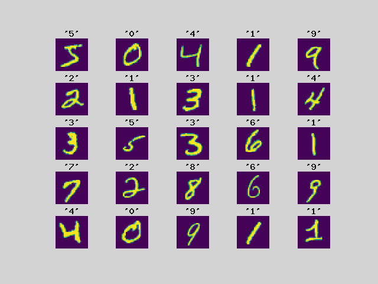

Experience various machine learning on PHP with Rindow Neural Networks.

Basic image clasification on PHP
--------------------------------
This is a tutorial for beginners. Experience a machine learning model with very simple image recognition.

[Basic image classification on PHP](basic-image-classification.html)

Convolutional Neural Network(CNN) on PHP
----------------------------------------
Create a simple model of a Convolutional Neural Network (CNN) using CIFAR-10, a slightly more complex image dataset.

[Convolutional Neural Network(CNN) on PHP](convolution-neural-network.html)

