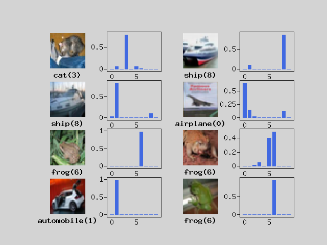

Experience various machine learning on PHP with Rindow Neural Networks.

- [Basic image classification on PHP](#basic-image-clasification-on-php)
- [Convolutional Neural Network(CNN) on PHP](#convolutional-neural-networkcnn-on-php)
- [Learning to add numbers with seq2seq on PHP](#learning-to-add-numbers-with-seq2seq-on-php)
- [Neural machine translation with attention](#neural-machine-translation-with-attention) 
- [Neural machine translation with transformer](#neural-machine-translation-with-transformer) 


Basic image clasification on PHP
--------------------------------
This is a tutorial for beginners. Experience a machine learning model with very simple image recognition.

[Basic image classification on PHP](basic-image-classification.html)


Convolutional Neural Network(CNN) on PHP
----------------------------------------
Create a simple model of a Convolutional Neural Network (CNN) using CIFAR-10, a slightly more complex image dataset.

[Convolutional Neural Network(CNN) on PHP](convolution-neural-network.html)



Learning to add numbers with seq2seq on PHP
----------------------------------------
Learn the addition of two numbers using Recurrent Neural Network (RNN) on PHP.

[Learning to add numbers with seq2seq on PHP](learn-add-numbers-with-rnn.html)

```php
# 583+885=1468 : * 1468
# 517+959=1476 : * 1476
# 437+571=1008 : * 1008
# 195+322=517  : * 517
# 258+623=881  : * 881
# 739+857=1596 : * 1596
# 580+724=1304 : * 1304
# 151+284=434  :   435
# 418+789=1207 : * 1207
# 52+889 =941  : * 941
```

Neural machine translation with attention
----------------------------------------
Machine translation of natural language using Recurrent Neural Network (RNN) and Attention

[Neural machine translation with attention on PHP](neural-machine-translation-with-attention.html)

```php
# Input:   <start> fermez la porte ! <end>
# Predict: close the door . <end>
# Target:  <start> close the door . <end>
```


Neural machine translation with Transformer
----------------------------------------
Machine Translation with Transformer Model

[Neural machine translation with Transformer on PHP](neural-machine-translation-with-transformer.html)

```php
# Input:   <start> je ferai de mon mieux . <end>
# Predict: <start> i ll do my best . <end>
# Target:  <start> i ll do my best . <end>
```


